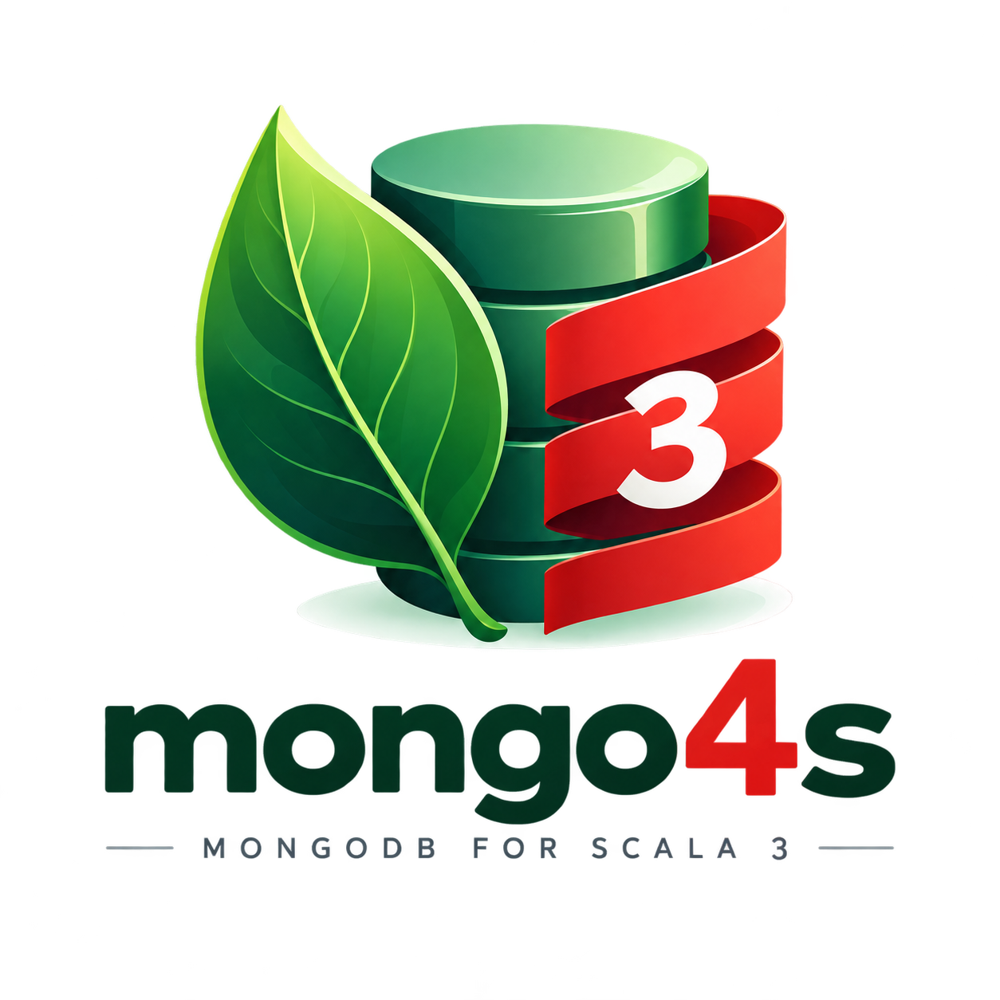
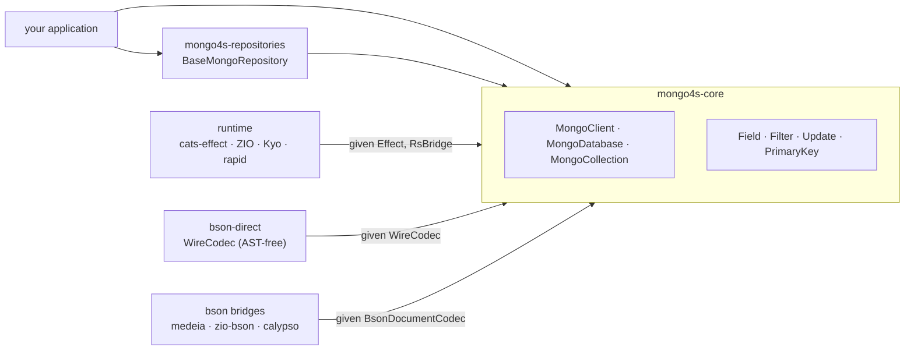

<p align="center">
  
</p>

# mongo4s

Effect-agnostic `MongoDB` client and repository layer for `Scala 3`. No hardcoded `cats-effect` or `fs2` — the runtime
(`cats-effect` / `ZIO` / `Kyo` / `rapid`) and the `BSON` codec (your own derivation, or `medeia` / `zio-bson` /
`calypso`) are
independent modules, each wired in through a `given` import. `core` depends on neither.

[](https://github.com/mongo4s/mongo4s/actions/workflows/ci.yml)
[](https://central.sonatype.com/search?q=mongo4s)
[](https://www.scala-lang.org/)
[](https://www.apache.org/licenses/LICENSE-2.0)

`mongo4s` wraps the official `mongodb-driver-reactivestreams` directly. A type-safe
`Field`/`Filter`/`Update` builder replaces string-keyed queries, `PrimaryKey` turns an entity into single- or
compound-key lookups, and `BaseMongoRepository` gives you CRUD/batch operations over a collection for free. Every
piece is interpretable against a real `MongoDB` **and** an in-memory `FakeMongoCollection`, so repositories are
unit-testable without a running database.



* [Quick start](#quick-start)
* [Core concepts](#core-concepts)
* [BSON codecs](#bson-codecs)
* [Repositories](#repositories)
* [Runtime backends](#runtime-backends)
* [Modules](#modules)
* [Benchmarks](#benchmarks)
* [Design notes](#design-notes)
* [Contributing](#contributing)

## Quick start

Pick a runtime. The default codec (`bson-direct`) derives straight from your case class — AST-free, no
third-party codec library, no extra dependency beyond `mongo4s-core` itself:

```scala
libraryDependencies ++= Seq(
  "org.mongo4s" %% "mongo4s-cats" % "2.0.0", // mongo4s-core + cats-effect integration
  "org.mongo4s" %% "mongo4s-bson-direct" % "2.0.0", // ast-free bson codecs
  "org.mongo4s" %% "mongo4s-bson-cats-data" % "2.0.0", // if you need NonEmptyList etc. codec instances
  "org.mongo4s" %% "mongo4s-repositories" % "2.0.0", // if you need auto-generated CRUD repository ops for your model
)
```

```scala
import cats.effect.{IO, IOApp}

import mongo4s.cats.{CatsStream, MongoClientResource}
import mongo4s.bson.direct.WireCodec
import mongo4s.{Field, PrimaryKey}
import mongo4s.repositories.BaseMongoRepository

import mongo4s.cats.CatsInstances.given

final case class User(id: String, name: String, age: Int) derives WireCodec

object User:
  given PrimaryKey[User, String] = PrimaryKey.single("id")(_.id)

object Main extends IOApp.Simple:
  def run: IO[Unit] =
    MongoClientResource.fromConnectionString[IO]("mongodb://localhost:27017").use { client =>
      for
        db <- client.getDatabase("myapp")
        collection <- db.getDirectCollection[User]("users")

        users = BaseMongoRepository(collection)

        _ <- users.insertOne(User("1", "Alice", 30))
        alice <- users.findOne("1")
        adults <- users.findByFilter(Field.of[User, Int](_.age).gte(18))
      yield ()
    }
```

Swap `mongo4s-cats` for `mongo4s-zio` / `mongo4s-kyo` / `mongo4s-rapid` and the matching `*Instances.given` import to
change runtime — nothing else in this snippet changes. `BsonEncoder`/`BsonDecoder` for built-in types (`String`,
`Int`, `Option`, `List`, `Vector`, `Set`, `Seq`, …) resolve with no import at all — no
`mongo4s.bson.BsonInstances.given` needed unless you're summoning one directly.

Already have a model on `medeia`, `zio-schema`, or `calypso`? Swap `derives WireCodec` + `getDirectCollection` for
`derives MedeiaDocumentCodec`/etc. + `getCollection` (and `BaseMongoRepository.create(db, "users")` instead of
constructing it from a collection directly) — see [BSON codecs](#bson-codecs) below for all four backends.

Already have a `MongoClientSettings` built elsewhere (connection pool tuning, read/write concerns, TLS, credentials,
…)? Use `MongoClientResource.fromSettings` instead of `fromConnectionString`. `MongoClient.fromClient`/`fromSettings`/
`fromConnectionString` give you the same thing unwrapped, if you'd rather own `.close` yourself.

A driver `CodecRegistry` is not how you plug a codec into `mongo4s`, though — see
[Codecs and the driver's registry](#codecs-and-the-drivers-registry).

For more examples see [examples/src/main/scala/mongo4s/examples](examples/src/main/scala/mongo4s/examples) — a
shared domain model (opaque types, enums, nested case classes) run through every runtime/codec combination
(`cats + medeia`, `ZIO + zio-bson`, `kyo + medeia`, `rapid + calypso`), a repository example covering all three
`BaseMongoRepository` construction styles against bson-direct, and a sessions/transactions + typed aggregation
pipeline example on `cats + medeia`. Most of what this README shows is compiled there too —
[`ReadmeSnippets.scala`](examples/src/main/scala/mongo4s/examples/ReadmeSnippets.scala) walks the same ground section by
section, so if the API moves and these docs don't, CI fails.

## Core concepts

`MongoClient[F, S]` → `MongoDatabase[F, S]` → `MongoCollection[F, S, A]` mirror the driver's own hierarchy, wrapped in
your effect `F[_]` and stream type `S[_]`:

```scala
trait MongoCollection[F[*], S[*], A]:
  def insertOne(document: A)(using session: Option[ClientSession] = None): F[InsertOneResult]

  def find(filter: Filter[A] = Filter.all)(using session: Option[ClientSession] = None): FindQuery[F, S, A]

  def updateOne(filter: Filter[A], update: Update[A], upsert: Boolean = false)(using session: Option[ClientSession] = None): F[UpdateResult]

  def deleteOne(filter: Filter[A])(using session: Option[ClientSession] = None): F[DeleteResult]

  def findOneAndUpdate(filter: Filter[A], update: Update[A], returnUpdated: Boolean = true,

...):
  F[Option[A]]

  def aggregate[B](pipeline: Seq[Stage[A]])(using session: Option[ClientSession] = None)(using BsonDocumentCodec[B]): AggregateQuery[F, S, B]

  def distinct[B](field: Field[A, B], filter: Filter[A] = Filter.all)(using session: Option[ClientSession] = None)(using BsonDecoder[B]): DistinctQuery[F, S, B]

  def createIndex(index: Index[A])(using session: Option[ClientSession] = None): F[String]

  def watch(options: WatchOptions[A] = WatchOptions.default[A])(using session: Option[ClientSession] = None)(using Streamable[S, ChangeEvent[A]]): S[ChangeEvent[A]]
// count, estimatedCount, insertMany, updateMany, deleteMany, bulkWrite, listIndexes, dropIndex, drop, ...
```

Every method that reaches the server takes an optional `ClientSession` and defaults to `None`, so none of that is
visible until you opt into [a transaction](#sessions--transactions).

### Field selectors

`Field.of[E, A](_.someField)` is a macro that reads a field selector at compile time — no strings, no reflection —
and gives you a typed path to build filters, updates, and sorts:

```scala
val adults = Field.of[User, Int](_.age).gte(18)
val named  = Field.of[User, String](_.name).equalTo("Jenna") && adults
val setAge = Field.of[User, Int](_.age).set(27)
val city   = Field.of[Order, String](_.address.city).equalTo("Barcelona") // dotted paths from nested selectors
```

Each segment is checked against the case class it is selected from, so `_.name.length` and `_.items.head.sku` are
compile errors rather than paths that render fine and match nothing.

Selector-derived names are spelled through the collection's `FieldNaming`. Names that are already what the document
stores — a map key, an array position, `_id`, a shape with no case class — go through `at`, `/` or `Field.stored`,
and are used verbatim:

```scala
val totals = Field.of[Order, Map[String, Int]](_.totals)
val eur    = totals.at("EUR")                         // "totals" is renamed, "EUR" is not
val first: Field[Order, Item] = itemsField / "0"      // any other stored segment
val id     = Field.stored[Order, ObjectId]("_id")
```

### Filters

```scala
ageField.gte(13) && ageField.lte(19)     // $and
ageField.notIn(List(40, 41, 42))         // $nin
tagsField.contains("urgent")             // array membership
tagsField.containsAll(List("a", "b"))    // $all
tagsField.hasSize(3)                     // $size
nameField.regex("^A")                    // $regex
scoreField.exists                        // $exists
Filter.text[User]("scala")               // $text
Filter.expr[User](someBsonDocument)      // $expr
```

The comparisons have symbolic aliases where they read better — `===`, `=!=`, `>`, `>=`, `<`, `<=` — spelling the
same `Filter` as `equalTo`/`notEqualTo`/`gt`/`gte`/`lt`/`lte`.

`itemsField.elemMatch(...)` is the one worth calling out: conditions combined on the array path alone can be
satisfied by *different* elements, and `$elemMatch` is how you require one element to satisfy all of them.

```scala
val bigOrder = itemsField.elemMatch(
  Field.of[Item, String](_.sku).equalTo("abc") && Field.of[Item, Int](_.quantity).gt(2)
)
```

`Filter.and`/`or` fold `Filter.all` and `Filter.none` away rather than emitting a one-element `$and`. That is what
makes an empty list safe: `field.in(Nil)` is `Filter.none`, not "match everything".

### Updates

```scala
ageField.set(31)                  // $set
ageField.inc(1)                   // $inc — also $mul, $min, $max
nameField.unset                   // $unset
tagsField.push("vip")             // $push — also $pull, $addToSet, and the $each variants
Update.setOnInsert(nameField, "") // $setOnInsert, for merge-style upserts
Update.rename(oldField, newField) // $rename — also currentDate, popFirst/popLast
```

Numeric operators only apply to numeric fields, so `Update.inc(nameField, 1)` does not compile. An `Option`-typed
field takes the unwrapped value — `scoreField.inc(5L)` on a `Field[User, Option[Long]]` — because `None` has no
numeric encoding, and the obvious stand-in, `$inc` by zero, is a write that quietly does nothing.

`Update.combine`/`and` merge operators of the same name into one sub-document, so setting two fields produces one
`$set`. `Update.Raw` carries operators the `AST` does not model and merges the same way:

```scala
Update.set(nameField, "bob").and(Update.Raw[User](BsonDocument("$bit", BsonDocument("age",...)
) ) )
// {"$set": {"name": "bob"}, "$bit": {"age": ...}}
```

Rendering never mutates the document you handed to `Raw`, so the same value can be reused across updates and
rendered under more than one `FieldNaming`.

An update that would produce no operators throws instead of sending `{}` — MongoDB rejects it, and failing at the
call site beats a write that silently does nothing.

`bulkWrite` takes a `Seq[WriteCommand[E]]` — `InsertOne`/`ReplaceOne`/`UpdateOne`/`UpdateMany`/`DeleteOne`/`DeleteMany`,
carrying the same `Filter` and `Update` values the single-document calls take:

```scala
collection.bulkWrite(
  Seq(
    WriteCommand.InsertOne(User("2", "Bob", 41)),
    WriteCommand.updateOne(named, setAge), // lowercase helpers default upsert = false
    WriteCommand.DeleteMany(ageField.lt(0)),
  )
)
```

Commands run in the order given; `ordered = false` lets the server carry on past one that fails instead of stopping
there. `BulkWriteResult.upsertedIds` is keyed by each command's position in the sequence.

### Queries

`find` returns a builder; nothing is sent until `first`, `all`, `stream` or `attempting`:

```scala
collection
  .find(adults)
  .sort(Sort.asc(nameField))
  .projection(Projection.empty[User].include(ageField).withoutId)
  .skip(20)
  .limit(10)
  .hint(indexKeys)
  .collation(Collation.builder().locale("en").build())
  .maxTime(5.seconds)
  .batchSize(100)
  .comment("adults page 3")
  .all
```

`filter` narrows what is already there — it ands with the filter the query was built from — while `sort`,
`projection`, `skip` and `limit` replace. `first` reads one document rather than the query's `limit`. The same
`hint`/`collation`/`maxTime`/`batchSize`/`comment` options are on `aggregate`, which adds `allowDiskUse`, and
`collation`/`maxTime`/`batchSize` on `distinct`.

`Projection` keeps inclusion and exclusion apart, because MongoDB rejects a projection mixing them. They are separate
types — `Projection.empty` starts neutral and the first `include` or `exclude` commits it — so chaining `exclude` onto
an inclusion projection does not compile at all, rather than silently returning more fields than you asked for. `_id`
is the exception: `withoutId` drops it from an inclusion projection, giving `{"field": 1, "_id": 0}`.

### Results

Writes report what actually happened. `UpdateResult` carries `matchedCount`, `modifiedCount` and `upsertedId`, which
is the only way to tell "matched but unchanged" from "nothing matched", or to recover the id an upsert generated:

```scala
val result = collection.updateOne(filter, update, upsert = true)
result.map(r => if r.wasUpserted then r.upsertedId else None)
```

`DeleteResult` carries `deletedCount`; `BulkWriteResult` carries all four counts plus `upsertedIds`, keyed by the
position of the command that produced it. `InsertOneResult`/`InsertManyResult` carry the stored `_id`s.

Under an unacknowledged write concern (`w=0`) the server sends nothing back, so every one of these comes back empty —
zero counts, `None` for the ids. That is indistinguishable from a write that matched nothing, which is the trade
`w=0` makes: the driver has no answer to report. Nothing throws, so the write path stays usable; if you need to tell
the two apart, do not use `w=0`.

### Reads that survive bad documents

`find(...).all` fails the whole query if any document does not decode. A collection is rarely written by one version
of one service, though, and when it isn't, a document that doesn't fit is a fact about the data rather than a reason
to lose the rest of the page. `attempting` reports each document separately:

```scala
val readable: IO[List[User]] =
  collection.find().attempting.all.map(_.collect { case Right(user) => user })

val everything: S[DecodeResult[User]] = collection.find().attempting.stream
```

`DecodeResult[A]` is `Either[BsonError, A]`. It's available on `find`, `aggregate` and `distinct`, and as
`watchAttempting` on every `watch`. Transport errors still fail the effect — only decoding is made per-document.

### Primary keys

`PrimaryKey[E, K]` turns an entity into a key-based filter — single field, a native `_id` (`ObjectId` or your own
encoder), or a compound key of up to four fields:

```scala
given PrimaryKey[User, String]         = PrimaryKey.single("id")(_.id)
given PrimaryKey[Note, ObjectId]       = PrimaryKey.storedId(_.id) // keys on "_id" — see WithId
given PrimaryKey[Order, (String, Int)] = PrimaryKey.compound(o => (o.userId, o.seq))("user_id", _._1)("seq", _._2)
```

`PrimaryKey.id(_.id)` is `single("id")` spelled short, for the common case; `compound3`/`compound4` extend the
compound form.

Field names are given separately from the extractors so the key knows them without a key value — that is what lets
`repository.ensureKeyIndex` build the unique index that makes the key a key. Without one, two concurrent `upsert`s
on the same key can both miss and both insert.

`storedId` keys on `_id` whatever the key's type; the entity's codec has to actually write it there, so an entity
whose codec writes `id` will never match. Note that these are **stored** names, used verbatim: the collection's
`FieldNaming` is not applied to them, so under `snakeCase` write `"user_id"`, not `"userId"`.

For entities that don't carry their own id field, `WithId[ObjectId, E]` ships a ready-made `PrimaryKey` — no `given`
needed.

`inFilter` on a compound key produces an `$or` of `$and`s; on a single field it's a plain `$in` — and an empty key
list always produces `Filter.none`, so `findMany(Nil)`/`deleteMany(Nil)` are safe no-ops instead of matching every
document.

### Sessions & transactions

`client.withTransaction` opens a session, runs the body in a transaction on it, and closes it — on every path:

```scala
client.withTransaction {
  users.insertOne(User("2", "Bob", 41)) // Option[ClientSession] is already given here
}
```

The session is given implicitly to everything inside the body, so a collection or repository call joins the
transaction without being told to — no `(using Some(session))` at each call site.

It commits on success and rolls back on failure **and on cancellation**: `Effect[F]` carries a `guaranteeCase` that
sees how the action ended, so an interrupted transaction does not linger on the server until it is reaped. A
rollback that itself fails is attached as a suppressed exception rather than replacing the error that caused it.

If you're reusing one already-open session across more than one transaction, the same behaviour applies to the session
itself — it commits and rolls back the same way, but leaves the session's own lifetime to you:

```scala
import mongo4s.withTransaction // the extension on ClientSession

for
  session <- client.startSession
  _       <- session.withTransaction(users.insertOne(User("2", "Bob", 41)))
  _       <- session.withTransaction(users.insertOne(User("3", "Carol", 29))) // same session, second transaction
  _       <- IO.delay(session.close())
yield ()
```

`MongoSession.startTransaction`/`commitTransaction`/`abortTransaction` are there for the fully manual path, where
you pass the session explicitly with `(using Some(session))` at each call site. Nothing is automatic on that path —
including the rollback.

Transactions need a replica set or sharded cluster.

### Aggregation pipelines

`aggregate` takes a `Seq[Stage[A]]` — a typed pipeline-stage AST, mirroring `Filter`/`Update`/`Sort`, instead of raw
`BsonDocument`s — built with the same `Field.of` selectors:

```scala
import mongo4s.operations.{Sort, Stage}

val pipeline = Seq(
  Stage.matching(Field.of[User, Int](_.age).gte(18)),
  Stage.sortBy(Sort.asc(Field.of[User, String](_.name))),
  Stage.limit(10),
)

// aggregate lives on the collection, and decodes into any type with a BsonDocumentCodec
val adults: IO[List[User]] = collection.aggregate[User](pipeline).all
```

Grouping uses typed accumulators:

```scala
import mongo4s.operations.Accumulator

val byAge = Seq(
  Stage.groupBy(Field.of[User, Int](_.age))(
    "count" -> Accumulator.count[User],
    "names" -> Accumulator.push(Field.of[User, String](_.name)),
  )
)
```

`Stage` covers `$match`/`$project`/`$sort`/`$limit`/`$skip`/`$count`/`$unwind`/`$lookup`/`$group`/`$addFields`/
`$replaceRoot`/`$facet`/`$sample`/`$unionWith`/`$out`/`$merge`,
with `Stage.raw(document)` as the escape hatch for anything else.

Two things about the typing. `A` is the pipeline's *starting* document type and never changes down the pipeline — a
`$group` or `$project` invents a new shape, but the stages after it are still typed against `A`, and the pipeline's
real output type is stated once, at `aggregate[B]`. And a field belonging to a stage's own output — `_id` after a
`$group`, a facet's counter — has no `Field[A, _]` to name it, so it goes through `Stage.raw`:

```scala
val buckets = Seq(
  Stage.groupBy(ageField)("count" -> Accumulator.count[User]),
  Stage.raw[User](BsonDocument("$sort", BsonDocument("_id", BsonInt32(1)))), // "_id" is the group's, not User's
)
```

For an output shape you'd rather not model, `BsonDocumentCodec[BsonDocument]` is in scope by default, so
`aggregate[BsonDocument]` just works — useful for `$facet` and ad-hoc `$project`s.

For a `bson-direct` entity, the output codec comes from `DocumentCodecBridge.toDocumentCodec[User]` — `aggregate`
and `distinct` decode through `BsonDocumentCodec`, not `WireCodec`.

### Indexes

`Index[E]` is built from the same field selectors, and carries the options MongoDB attaches to an index:

```scala
import mongo4s.operations.Index

collection.createIndex(Index.ascending(nameField).descending(ageField).named("name_age"))
collection.createIndex(Index.unique(idField))
collection.createIndex(Index.ascending(createdAtField).expiringAfter(30.days)) // TTL
collection.createIndex(Index.ascending(ageField).where(ageField.gte(18))) // partial
collection.createIndex(Index.empty[User].text(bioField).withSparse)

collection.listIndexes // F[List[BsonDocument]], as the server reports them
collection.dropIndex("name_age")
```

Keys are ordered — a compound index is only usable by queries that respect that order. `createIndex` returns the
name the server gave it, and is idempotent, so it's safe on every start.

`expireAfterSeconds` is a whole number on the server, so a sub-second `TTL` is rejected rather than silently truncated
to "expire immediately".

From a repository, `ensureKeyIndex` builds the unique index the `PrimaryKey` describes, without you restating its
fields.

### Change streams

`watch` exists at all three levels, matching the driver's own scope hierarchy — `MongoClient.watch` (the whole
deployment), `MongoDatabase.watch` (one database), and `MongoCollection.watch` (one collection). All of them need a
replica set or sharded cluster:

```scala
val events: S[ChangeEvent[User]] = collection.watch()
```

Every event is a `ChangeEvent[A]`, not a bare `BsonDocument`:

```scala
final case class ChangeEvent[A](
  operationType: OperationType, // com.mongodb's own enum — INSERT/UPDATE/DELETE/...
  documentKey: Option[BsonDocument],
  fullDocument: Option[A],
  fullDocumentBeforeChange: Option[A],
  updateDescription: Option[UpdateDescription], // updated/removed field paths, for UPDATE events
  resumeToken: BsonDocument,
  clusterTime: Option[BsonTimestamp],
)
```

`MongoCollection.watch` decodes through the collection's own codec, so `fullDocument`/`fullDocumentBeforeChange`
come back as `Option[A]`. `MongoClient.watch`/`MongoDatabase.watch` span more than one document shape, so they
default to `ChangeEvent[BsonDocument]` — use `watchAs[A]` when you know the events all decode the same way.

Everything else is `WatchOptions[A]`:

```scala
import mongo4s.changestream.WatchOptions

collection.watch(
  WatchOptions
    .resumeAfter[User](token) // shorthand for default[User].resumingAfter(token)
    .withFullDocument(FullDocument.DEFAULT)
    .withMaxAwaitTime(2.seconds)
    .withBatchSize(64)
)

WatchOptions.default[User].startingAfter(token) // the other two starting points, same builder
WatchOptions.default[User].startingAt(timestamp)
```

`fullDocument` defaults to `UPDATE_LOOKUP`, not the server's own default — MongoDB fills the document in only for
inserts and replaces, which leaves the most common question ("what does this document look like now?") unanswered on
updates. It is always `None` for deletes; there is no document left to look up. `fullDocumentBeforeChange` needs
pre-images enabled on the collection.

`resumeToken` is on every event so a consumer that dies mid-stream can restart from just after the last event it
actually handled, rather than from now:

```scala
collection.watch().evalTap(handle).evalTap(e => saveToken(e.resumeToken))
// later, on restart:
collection.watch(WatchOptions.resumeAfter[User](savedToken))
```

`resumingAfter` and `startingAfter` are alternatives — each clears the other, since the server rejects a stream
carrying both `resumeAfter` and `startAfter`.

`WatchOptions.pipeline` filters the change stream itself, and matches against the **change event's own shape**
(`{operationType, fullDocument, ns, ...}`), not the collection's document shape. A `Field.of` path is therefore the
wrong tool: it would render `"age"` where the event needs `"fullDocument.age"`. Use `Stage.raw`, or `Field.stored`
for a path under `fullDocument`:

```scala
val insertsOnly = WatchOptions[User](
  pipeline = Seq(Stage.raw(BsonDocument("$match", BsonDocument("operationType", BsonString("insert")))))
)

collection.watch(insertsOnly)
```

A change stream never completes on its own — take from it, or interrupt it. A document that does not decode ends it
with an error; `watchAttempting` reports the failure and carries on instead, which is what you want for a
long-lived subscription.

## BSON codecs

Every codec ultimately produces a `mongo4s.bson.BsonDocumentCodec[A]` (entity ⇄ `org.bson.BsonDocument`) or, for the
*AST-free* path below, a `WireCodec[A]`. Bring whichever backend fits — `mongo4s` never registers a global
`CodecProvider`, so backends never collide inside one process.

| Module | Backend                                                                        | Notes |
| --- |--------------------------------------------------------------------------------| --- |
| `mongo4s-bson-medeia` | [medeia](https://github.com/medeia/medeia)                                     | `derives BsonDocumentCodec` |
| `mongo4s-bson-zio` | [zio-bson](https://github.com/zio/zio-bson)                                    | `zio.bson.BsonCodec` (add `zio-schema-bson` yourself to derive one from a `Schema`) |
| `mongo4s-bson-calypso` | [calypso](https://github.com/m2-oss/calypso)                                   | hand-written `forProductN` codecs |
| `mongo4s-bson-direct` | [mongo4s itself](https://github.com/mongo4s/mongo4s/tree/main/bson/direct/src) | `WireCodec[A]`, AST-free — see below |
| `mongo4s-bson-cats-data` | [cats-core](https://typelevel.org/cats/) | `BsonEncoder`/`BsonDecoder`/`WireCodec` for `NonEmptyList`/`Chain`/`NonEmptyVector`/`NonEmptySet`/`NonEmptyMap`, `WireCodec` for `Ior` |

### `bson-direct` — AST-free `WireCodec`

`medeia`/`zio-bson`/`calypso` all build an intermediate `org.bson.BsonValue` tree before it ever reaches the driver.
`WireCodec[A]` skips that: it's derived via `Mirror` and writes straight to the driver's own streaming
`BsonWriter`/`BsonReader`, the same low-level SPI jsoniter-scala uses for JSON — no `BsonDocument` is ever built, on
either side. No third-party codec dependency needed; `bson-direct` is transitively pulled in by `mongo4s-core`.

```scala
import mongo4s.bson.direct.WireCodec

final case class Address(city: String, zip: String) derives WireCodec
final case class Person(id: String, name: String, tags: List[String], address: Address) derives WireCodec

sealed trait Shape derives WireCodec
object Shape:
  final case class Circle(radius: Double)                   extends Shape derives WireCodec
  final case class Rectangle(width: Double, height: Double) extends Shape derives WireCodec
```

Products, `Option`, `Either`, nested case classes, sealed traits/enums (via a `_type` discriminator field, written
first), and self-/mutually-recursive types all derive directly — recursive derivation is deferred behind a `lazy val`
internally so a type's own `given` never forces itself mid-construction. Anything with an existing `BsonEncoder`/
`BsonDecoder` (`ObjectId`, `Instant`, `UUID`, …) bridges automatically, at the cost of one `BsonValue` per field
instead of zero.

`List`/`Vector`/`Seq`/`Set`/`Array` write a real BSON array, and `Map[String, A]` a real `BSON` document keyed by its
own keys — `String` being the key type isn't a limitation of the general mechanism, it's just what BSON's own field
names are. Every *other* `Iterable` collection with a `scala.collection.Factory` (`Queue`, `ArraySeq`, `ListSet`,
`LazyList`, `SortedSet`/`TreeSet` given an `Ordering`, …) gets an array-shaped `WireCodec` too, generically — no
dedicated `given` needed per type.

`getDirectCollection` registers the derived codec with the driver via `CodecRegistries.fromCodecs(...)`, so
`insert/find/replace/update/delete/bulkWrite` decode straight to `A` — genuinely zero `BsonDocument` construction on the
hot path, not just a thinner bridge:

```scala
import mongo4s.bson.direct.WireCodec
import mongo4s.repositories.BaseMongoRepository

final case class Person(id: String, name: String, age: Int) derives WireCodec
object Person:
  given PrimaryKey[Person, String] = PrimaryKey.single("id")(_.id)

for
  db         <- client.getDatabase("myapp")
  collection <- db.getDirectCollection[Person]("people")
  repo        = BaseMongoRepository(collection)
  _          <- repo.insertOne(Person("1", "bob", 30))
yield ()
```

The trade for that speed is strictness: derivation requires every modelled field to be present, unless its decoder
supplies a default — which `Option` does. So a **projection that drops a field the entity declares cannot be read
back** through a direct collection. Use `getCollection` with a `BsonDocumentCodec`, or model the projected shape as
its own type, when you need partial reads.

Strictness extends to BSON numeric types. A `Long` field is read with `readInt64`, an `Int` with `readInt32`, a
`Double` with `readDouble` — the exact type the encoder writes. So a document that stores `42` as an Int32 (written
by `mongosh`, by a `$inc`, or by another client) decodes fine through `getCollection`, whose `BsonDecoder[Long]`
accepts any whole number, and **fails** through `getDirectCollection`. The failure is an ordinary `BsonError`, so
`attempting` reports it per document like any other decode error. If a collection holds mixed numeric widths for the
same field, read it through `getCollection`.

`aggregate`/`distinct` still go through `BsonDocumentCodec`/`BsonDecoder` on a direct collection (their output shape
isn't `A`, and they're not the hot path); everything else — `Filter`/`Update`/`Field` construction — is identical
regardless of which codec backs the collection.

#### Field naming

By default `derives WireCodec` writes field and discriminator names exactly as they appear in the Scala source. To
match an existing collection's naming convention (`snake_case`, say), bring a `WireCodecConfig` into scope before
deriving — it reuses the same `mongo4s.bson.FieldNaming` the query layer (`Filter`/`Update`/`Sort`) already uses,
rather than a second, independent naming mechanism:

```scala
import mongo4s.bson.direct.WireCodecConfig

given WireCodecConfig = WireCodecConfig.SnakeCase

final case class Person(firstName: String, lastName: String) derives WireCodec // writes "first_name"/"last_name"
```

Field naming and discriminator naming (the `_type` value for sealed traits/enums) are independently configurable.
`WireCodecConfig` is built by starting from `Default` (or `SnakeCase`) and chaining `withFieldNaming`,
`withDiscriminatorNaming`, `withEncodeEmptyCasesAsString`, `withOmitNoneFields` — the same shape `WatchOptions` uses,
and the reason new derivation options can be added in a minor release without breaking binary compatibility:

```scala
given WireCodecConfig = WireCodecConfig.SnakeCase.withDiscriminatorNaming(FieldNaming.snakeCase)
```

`WireCodecConfig` only affects how `WireCodec`
derives — pass the matching `FieldNaming` (e.g. `WireCodecConfig.SnakeCase.fieldNaming`) to `getDirectCollection`'s
own `naming` parameter too, so `Filter`/`Update`/`Field` queries render the same field names the codec wrote.

`FieldNaming` applies per *derived* segment only. Stored names — `Field.stored`, a `PrimaryKey`'s field names, a
`$lookup`'s foreign field, map keys — are used verbatim. `FieldNaming.snakeCase` splits on every capital, so
`userID` becomes `user_i_d`; `FieldNaming.overrides(Map("userID" -> "userId"), fallback = snakeCase)` is the way out
of that.

`encodeEmptyCasesAsString = true` writes a parameterless case (`case object`/empty `case class`) as a bare BSON
string instead of a `{"_type": "..."}` document — only safe when that case is nested inside another document, not
when it's the root type of a collection (BSON's root value must always be a document).

#### Absent `Option` fields

A field holding `None` is **left out of the document entirely** rather than stored as an explicit `null` — the key
costs nothing on disk, and a collection of mostly-empty optional fields gets materially smaller. Reads are
unaffected either way: a missing field decodes to `None` through the same `defaultOnMissing` that has always
covered it, and a document already carrying an explicit `null` still decodes to `None`, so a collection written
before this keeps working unchanged.

```scala
final case class Contact(name: String, email: Option[String]) derives WireCodec

Contact("bob", None) // {"name": "bob"} — no "email" key at all
```

Two things do change with the field gone. `{field: null}` as a filter still matches, since MongoDB reads that
predicate as "null **or** missing", but `$exists: true` no longer matches a `None`, and a **sparse index** on that
field no longer includes those documents. Where either matters, `withOmitNoneFields(false)` restores the explicit
`null`:

```scala
given WireCodecConfig = WireCodecConfig.Default.withOmitNoneFields(false)
```

A nested `Option` does not survive a round-trip, with or without the flag: `Some(None)` is written as `null` and reads
back as `None`, because BSON has one null and both layers map onto it. This is true of the AST path
(`BsonEncoder`/`BsonDecoder`) as well. If you need to tell "absent" from "present but empty", model it as an `enum`
or a wrapper case class rather than `Option[Option[A]]`.

The flag governs *fields of a derived product* only. A `None` inside an array is still written as `null` regardless,
because dropping an element would shift every position after it. `Update.set(field, None)` also still writes `null` —
that is `BsonEncoder`, not `WireCodec`, and `$set: null` and `$unset` are different intents; use `field.unset` for
the latter. The AST bridges (`medeia`, `zio-bson`, `calypso`) follow their own library's rule here, not this flag.

#### Hand-writing a codec: `contramap`/`map`/`emap`/`imap`

Most types don't need `derives WireCodec` at all — `WireCodec[A]` is just `WireEncoder[A] with WireDecoder[A]`, and
both halves compose the same way `BsonEncoder`/`BsonDecoder` already do elsewhere in mongo4s:

```scala
import mongo4s.bson.direct.WireCodec

enum Provider(val value: String):
  case Stripe extends Provider("stripe")
  case Adyen  extends Provider("adyen")

object Provider:
  def from(value: String): Option[Provider] = Provider.values.find(_.value == value)

  given WireCodec[Provider] =
    WireCodec[String].iemap(raw => from(raw).toRight(s"Unsupported provider: $raw"))(_.value)
```

`imap` (total in both directions) and `iemap` (decode can fail — reported as `BsonError.InvalidValue`) replace a
hand-rolled `WireCodec.instance(...)` for the common case of one type wrapping another: no `BsonWriter`/`BsonReader`
calls to write by hand, and the wrap/unwrap logic lives in exactly one place instead of being duplicated across the
encode and decode sides.

Resolution order matters when a type qualifies for more than one instance. An existing `BsonEncoder`/`BsonDecoder`
pair — hand-written, or coming from `mongo4s-bson-medeia`/`-zio`/`-calypso` — is bridged into a `WireCodec` and takes
precedence over automatic `Mirror` derivation, so a case class carrying those instances resolves without needing
`derives WireCodec`. Writing `derives WireCodec` on the type still wins over both: it puts a concrete instance in the
companion, which is more specific than either generic given.

#### `ScalarWireCodec` — reusing a `WireCodec` as a `BsonEncoder`

An opaque type over a primitive (`opaque type UserId = String`) typically needs a `WireCodec[UserId]` for
`getDirectCollection` *and* a `BsonEncoder[UserId]` for `Field.of[...].equalTo`/`PrimaryKey.single` — two
typeclasses, normally two independently hand-written codecs. `ScalarWireCodec[A]` — the type every primitive in
`WirePrimitiveInstances` actually has — closes that gap:

```scala
import mongo4s.bson.direct.ScalarWireCodec
import mongo4s.bson.BsonEncoder

opaque type UserId = String

object UserId:
  def apply(value: String): UserId = value
  extension (id: UserId) def value: String = id

  given ScalarWireCodec[UserId] = ScalarWireCodec[String].imap(UserId.apply)(_.value)
  given BsonEncoder[UserId]     = summon[ScalarWireCodec[UserId]].toBsonEncoder
```

`toBsonEncoder` builds one `BsonValue` per call — cheap on the query-construction path `BsonEncoder` actually runs
on, unlike materializing one for every field of every document, which is exactly what `WireCodec` exists to avoid
in the first place. `ScalarWireCodec` is deliberately narrower than `WireCodec`: a derived case class or sum type
(`derives WireCodec`) is genuinely document-shaped, so it's never typed as `ScalarWireCodec` — asking for one
(`ScalarWireCodec[SomeCaseClass]`) fails to compile instead of misbehaving at runtime.

#### `Either[A, B]`

`WireCodec[Either[A, B]]` derives given `WireCodec[A]` and `WireCodec[B]`, flat like a derived sealed trait
(`{"_type": "Circle", "radius": 2.0}`) rather than wrapped in a `Left`/`Right` envelope — the discriminator is each
branch's own runtime type name, and a document-shaped branch (a case class) has its fields inlined directly instead
of nested under a `"value"` key:

```scala
final case class ValidationError(message: String)
final case class Approved(reference: String)

// Right(Approved("abc")) -> {"_type": "Approved", "reference": "abc"}
// Left(ValidationError("bad input")) -> {"_type": "ValidationError", "message": "bad input"}
val result: Either[ValidationError, Approved] = ...
```

A scalar branch (no fields to inline, e.g. a bare `String`) keeps a `"value"` field, since a bare BSON scalar can't
also carry the discriminator in the same slot. The two branches must resolve to distinguishable type names —
`Either[Foo, Foo]`, or two differently-named types that happen to share a runtime class name once generics are
erased, throws when the codec is summoned rather than risking a silent wrong-branch decode later.

The discriminator is `ClassTag[A].runtimeClass.getSimpleName` — for `Int`/`Long`/`Double`/`Boolean`/etc, that's the *JVM
primitive's* name (`"int"`, not `"Integer"`), since `ClassTag[Int]`'s `runtimeClass` is the primitive class,
not the boxed one. Not a bug, just worth knowing if one branch is a bare numeric/boolean type.

### `bson-cats-data` — `cats.data` support

`NonEmptyList`/`Chain`/`NonEmptyVector`/`NonEmptySet`/`NonEmptyMap` get `BsonEncoder`/`BsonDecoder` and `WireCodec`
instances from `mongo4s-bson-cats-data`, delegating to the already-existing `List`/`Vector`/`Set`/`Map` instances
rather than reimplementing `BSON` encoding:

```scala
import mongo4s.bson.catsdata.CatsDataBsonInstances.given // or CatsDataWireInstances.given for bson-direct
import cats.data.NonEmptyList

final case class Team(members: NonEmptyList[String]) derives MedeiaDocumentCodec // or your codec backend's own derives
```

`NonEmptySet`/`NonEmptyMap` additionally need a `cats.Order` for their element/key type — the same `Order` you'd
already need to construct one of these types directly.

`Ior[A, B]` gets a `WireCodec` too — flat and discriminated by each branch's own type name, the same idea as
`bson-direct`'s own `Either[A, B]` above, not `"Left"`/`"Right"`/`"Both"`. `Both` doesn't have a
single "own" type — it holds an `A` and a `B` at once — so its discriminator is the two names joined (`"String+Foo"`),
with each side nested under its own `"left"`/`"right"` key rather than inlined, to avoid a silent
field-name collision if `A` and `B` happen to share a field.

### Codecs and the driver's registry

The driver resolves codecs from a process- or client-wide `CodecRegistry`. `mongo4s` does not: a codec is resolved per
collection, from the `BsonDocumentCodec[A]` or `WireCodec[A]` in implicit scope at the `getCollection` /
`getDirectCollection` call. That is what lets medeia, zio-bson, calypso and `bson-direct` coexist in one process
without colliding.

So a `CodecRegistry` you set on `MongoClientSettings` is **not** where an entity codec belongs — mongo4s never asks it
for one, on either path:

* On the `getCollection` path, `mongo4s` asks the driver for `BsonDocument` and does its own encode/decode. So do
  `listIndexes`, `listCollections`, `runCommand`, `aggregate`, `distinct` and `watch` — all of them read
  `BsonDocument`/`BsonValue`. Your registry is never asked about `A`.
* On the `getDirectCollection` path, `mongo4s` registers the derived `WireCodec[A]` **ahead of** the client's registry,
  so a `Codec[A]` registered there does not silently shadow the codec the collection was opened with.

That does not make it inert, though. It is still load-bearing in two ways:

* **It has to keep providing the driver's own `BsonDocument` codec.** Since `mongo4s` reads and writes `BsonDocument`
  everywhere, a registry that *replaces* the defaults instead of extending them fails every single operation with
  `CodecConfigurationException: Can't find a codec for … BsonDocument`. Always build yours as
  `CodecRegistries.fromRegistries(yours, MongoClientSettings.getDefaultCodecRegistry)`.
* **It governs everything past `underlying`.** `MongoClient`/`MongoDatabase`/`MongoCollection` each expose the driver
  object they wrap, and there the driver's rules apply in full — `collection.underlying.withDocumentClass(classOf[Foo])`
  resolves `Foo` from your registry, `mongo4s` not involved.

So: set a registry for driver-level defaults, or for a type you handle through the escape hatch — not to route the
entities `mongo4s` already has codecs for.

## Repositories

`BaseMongoRepository[F, S, E, K]` implements `Repository` — `count/find/insert/upsert/update/delete/bulkWrite`, batched
by `batchSize` (default 500) — over any `MongoCollection[F, S, E]`, from either codec path:

```scala
BaseMongoRepository(collection)                              // over a collection you already have
BaseMongoRepository.create[F, S, E, K](db, "collection")     // reads return the document as stored, _id included
BaseMongoRepository.withoutId[F, S, E, K](db, "collection")  // strips _id from reads — for entities that do not model it
BaseMongoRepository.objectId[F, S, E](db, "collection")      // WithId[ObjectId, E], auto _id round-trip
```

`create` is the default. Reach for `withoutId` only when the entity genuinely does not model `_id` and its codec
would reject the extra field — never for an entity keyed on `_id`, since the key would come back missing.

Paging goes through `Page`:

```scala
import mongo4s.repositories.Page

users.findByFilter(adults, Page.sortedBy(Sort.asc(nameField)).skipping(20).taking(10))
users.getBy(adults, Page.first(100)) // same, as a stream
```

Skip-based paging re-scans what it skips, so it degrades on deep pages; for a large collection, filter on the last
key you saw instead — `findByFilter` takes any `Filter[E]`.

`ensureKeyIndex` builds the unique index the `PrimaryKey` describes. `WithId[Id, E]` wraps an entity with a
separately-typed id (`type Oid[E] = WithId[ObjectId, E]`) and ships its own `PrimaryKey`/`BsonDocumentCodec`
instances, for entities that don't carry their own id field — it lives in `mongo4s-core`, so it's available whether
or not you use the repository layer.

Like `MongoCollection`, every `Repository` method takes `(using session: Option[ClientSession] = None)` — a
repository call can join a [transaction](#sessions--transactions) the same way a raw `collection` call can.

`BaseMongoRepository` is `open`: adding a domain query means declaring it against `collection`/`Filter`/`Field`
directly, not reimplementing what's already there.

For unit tests, `FakeMongoCollection` (in `mongo4s-testkit`, a published module — add it as
`"org.mongo4s" %% "mongo4s-testkit" % "2.0.0" % Test`) implements `MongoCollection` in memory — the exact same `Filter`/`Update`/`Field` AST
the real driver interprets is interpreted against an in-memory buffer instead, so repository logic is testable
without a running MongoDB. Filters, updates, sorting, paging and projections are simulated; `aggregate`, `distinct`,
`watch`, `$text`, `$expr` and `Filter.Raw` throw `UnsupportedOperationException` naming what was asked for, rather
than quietly answering wrong. Replace-based upserts — what `upsert`/`upsertMany` go through — insert on a miss the
way the server does; an `update`-based `upsert = true` that matches nothing throws instead of guessing what the
operators would have built.

## Runtime backends

Each runtime module provides `given Effect[F]` (sequencing, failure, and a finalizer that sees how the action ended)
and `given RsBridge[F, S]` (Reactive-Streams `Publisher` → `F`/`S`):

| Module | Effect | Stream | Notes |
| --- | --- | --- | --- |
| `mongo4s-cats` | any `F` with `cats.effect.kernel.Async` | `fs2.Stream` | via `fs2.interop.reactivestreams` |
| `mongo4s-zio` | `zio.Task` | `zio.stream.ZStream` | via `zio-interop-reactivestreams` |
| `mongo4s-kyo` | `A < (Async & Abort[Throwable])` | `kyo.Stream` | via `kyo-reactive-streams` |
| `mongo4s-rapid` | `rapid.Task` | `rapid.Stream` | |

`MongoClient.fromClient`/`fromSettings`/`fromConnectionString` return a bare `F[MongoClient[F, S]]` — you own calling
`.close`. Every runtime module also ships `MongoClientResource` with the same three constructor names, wrapped in
that runtime's own resource-safety idiom rather than one type copy-pasted across all four:

```scala
// cats — cats.effect.Resource
import mongo4s.cats.MongoClientResource

MongoClientResource.fromConnectionString[IO]("mongodb://localhost:27017").use { client =>
  // logic
}
```

```scala
// zio — ZIO.acquireRelease, released when the enclosing ZIO.scoped block exits
import mongo4s.zio.MongoClientResource

ZIO.scoped:
  for
    client <- MongoClientResource.fromConnectionString("mongodb://localhost:27017")
    ...
  yield ()
```

```scala
// kyo — Scope.acquireRelease, released by Scope.run
import mongo4s.kyo.MongoClientResource

Scope.run:
  for
    client <- MongoClientResource.fromConnectionString("mongodb://localhost:27017")
    ...
  yield ()
```

```scala
// rapid has no Resource/Scope type — Task.guarantee is its only finalizer primitive, attached to an
// already-known computation — so this is bracket-shaped (a `use` callback) instead of a composable value
import mongo4s.rapid.MongoClientResource

MongoClientResource.fromConnectionString("mongodb://localhost:27017") { client =>
  // logic
}
```

### Bridge configuration

`RsBridgeConfig` controls how a driver `Publisher` becomes your `F` and `S`. A `given` of your own overrides the
default wherever an `RsBridge` is summoned:

```scala
import mongo4s.RsBridgeConfig

given RsBridgeConfig = RsBridgeConfig(
  bufferSize         = 512,             // outstanding demand for streaming reads
  timeout            = Some(5.seconds), // per non-streaming operation; unset by default
  strictSingleResult = false,           // fail on a second result instead of taking the first
)
```

`bufferSize` bounds memory against a fast cursor; it does not apply to `all`, which asks for everything by
definition. `timeout` is a backstop for a cursor that stops signalling entirely — the driver has its own timeouts,
and streams are deliberately excluded, since a change stream sitting idle is working rather than stuck.
`strictSingleResult` is off by default, matching the driver.

Operations that expect at most one document read two, not the whole cursor — enough to notice a second result under
`strictSingleResult`, and no more. `AggregateQuery.first` pushes a `$limit` into the pipeline for the same reason.

## Modules

Published for Scala 3 under `org.mongo4s`:

```scala
"org.mongo4s" %% "mongo4s-<module>" % "2.0.0"
```

| | Module | Min. Scala | Notes |
| --- | --- | --- | --- |
| core | `mongo4s-core` | 3.3 LTS | `MongoClient`/`MongoDatabase`/`MongoCollection`, `Field`/`Filter`/`Update`, `PrimaryKey`, `WithId`; depends on `bson-core` + `bson-direct` only |
| bson | `mongo4s-bson-core` | 3.3 LTS | `BsonEncoder`/`BsonDecoder`/`BsonDocumentCodec` — the scalar + document codec seam |
| | `mongo4s-bson-direct` | 3.3 LTS | `WireCodec[A]` — AST-free product/sum derivation, no third-party dependency |
| | `mongo4s-bson-cats-data` | 3.3 LTS | `cats.data` (`NonEmptyList`/`Chain`/`NonEmptyVector`/`NonEmptySet`/`NonEmptyMap`/`Ior`) instances |
| | `mongo4s-bson-medeia` | 3.3 LTS | bridges `medeia`'s `derives BsonDocumentCodec` |
| | `mongo4s-bson-zio` | 3.3 LTS | bridges `zio-bson` (add `zio-schema-bson` yourself for the `Schema`-derived route) |
| | `mongo4s-bson-calypso` | **3.8** | bridges `calypso`'s `forProductN` |
| runtime | `mongo4s-cats` | 3.3 LTS | `cats-effect 3` + `fs2` |
| | `mongo4s-zio` | 3.3 LTS | ZIO 2 + `zio-streams` |
| | `mongo4s-kyo` | **3.8** | kyo 1.0.0-RC6 |
| | `mongo4s-rapid` | **3.8** | rapid |
| repositories | `mongo4s-repositories` | 3.3 LTS | `BaseMongoRepository`, `Repository`, `Page` |
| testkit | `mongo4s-testkit` | 3.3 LTS | `FakeMongoCollection`, `FakeRepository` — in-memory doubles for unit tests |

### Compatibility

From 1.0.0 onward, binary compatibility within a major version is checked by
[MiMa](https://github.com/lightbend/mima) on every build, new `Effect`/`RsBridge` methods carry default
implementations, and deprecations get at least one minor release before removal. `1.1.0` carries one deliberate,
filtered exception. The `3.8`-pinned modules cannot be consumed from a `3.3 LTS` project, and `mongo4s-kyo` sits
outside the promise while kyo is on a release candidate.

Full policy, the per-release exception list and the Scala-version rules: **[COMPATIBILITY.md](COMPATIBILITY.md)**.

## Benchmarks

Three JMH harnesses in [`benchmarks/`](benchmarks), against `mongo4cats` as a reference point. The short version:
`bson-direct`'s `WireCodec` writes and reads real BSON bytes **3.2–3.8×** faster than either `mongo4cats` codec and
allocates up to **6.9×** less; against a real `MongoDB` every single-document operation lands inside run-to-run
error for all six stacks, while bulk reads pull ahead — `mongo4cats` allocates **2.6–15×** more on
`findAll`/`findStream`, and its `find(...).stream` runs at **397 ops/s** against `mongo4s`'s **1465**.

Every table, the methodology and the commands to reproduce them: **[BENCHMARKS.md](BENCHMARKS.md)**.

## Design notes

Four decisions the rest of the library follows from: **Scala 3 only**, so field selectors can be macros and codecs
can be `derives`; **no global state**, so codecs are per-collection and four backends coexist in one process;
**`Effect[F]`'s `guaranteeCase` sees cancellation**, so an interrupted transaction rolls back instead of lingering;
and **`Filter`/`Update` are a real AST**, not the driver's opaque builders, so the same query runs against MongoDB
or against an in-memory buffer.

Each of those, the failure that motivated it, the sharp edges accepted along the way, and what was rejected:
**[DESIGN.md](DESIGN.md)**.

## Contributing

Bug reports and PRs are welcome. See [CONTRIBUTING.md](CONTRIBUTING.md) for how to build the project,
run its tests, and where to make changes for common kinds of contributions. This project follows the
[Contributor Covenant](CODE_OF_CONDUCT.md); please report security issues per [SECURITY.md](SECURITY.md)
rather than in a public issue.

## License

Apache 2.0 — see [LICENSE](LICENSE).
