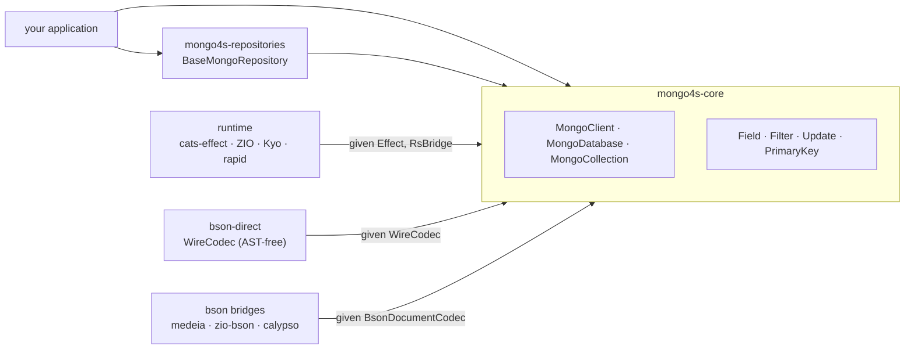

<p align="center">
  
</p>

# mongo4s

Effect-agnostic MongoDB client and repository layer for Scala 3. No hardcoded `cats-effect` or `fs2` — the runtime
(`cats-effect` / ZIO / Kyo / rapid) and the BSON codec (your own derivation, or medeia / zio-bson / calypso) are
independent modules, each wired in through a `given` import. `core` depends on neither.

[](https://github.com/mongo4s/mongo4s/actions/workflows/ci.yml)
[](https://central.sonatype.com/search?q=mongo4s)
[](https://www.scala-lang.org/)
[](https://www.apache.org/licenses/LICENSE-2.0)

mongo4s wraps the official `mongodb-driver-reactivestreams` directly — no `mongo4cats` underneath. A type-safe
`Field`/`Filter`/`Update` builder replaces string-keyed queries, `PrimaryKey` turns an entity into single- or
compound-key lookups, and `BaseMongoRepository` gives you CRUD/batch operations over a collection for free. Every
piece is interpretable against a real MongoDB **and** an in-memory `FakeMongoCollection`, so repositories are
unit-testable without a running database.



* [Quick start](#quick-start)
* [Core concepts](#core-concepts)
* [BSON codecs](#bson-codecs)
* [Repositories](#repositories)
* [Runtime backends](#runtime-backends)
* [Modules](#modules)
* [Benchmarks](#benchmarks)
* [Design notes](#design-notes)
* [Contributing](#contributing)

## Quick start

Pick a runtime and a codec bridge:

```scala
libraryDependencies ++= Seq(
  "org.mongo4s" %% "mongo4s-cats"         % "0.1.0",
  "org.mongo4s" %% "mongo4s-bson-medeia"  % "0.1.0",
  "org.mongo4s" %% "mongo4s-repositories" % "0.1.0", // if you need auto-generated CRUD repository ops for your model
)
```

```scala
import cats.effect.{IO, IOApp}

import mongo4s.{Field, MongoClient, PrimaryKey}
import mongo4s.bson.BsonInstances.given
import mongo4s.bson.medeia.MedeiaDocumentCodec
import mongo4s.bson.medeia.MedeiaInstances.given
import mongo4s.cats.CatsInstances.given
import mongo4s.cats.CatsStream
import mongo4s.repositories.BaseMongoRepository

final case class User(id: String, name: String, age: Int) derives MedeiaDocumentCodec

object User:
  given PrimaryKey[User, String] = PrimaryKey.single("id")(_.id)

object Main extends IOApp.Simple:
  type S[A] = CatsStream[IO][A]

  def run: IO[Unit] =
    for
      client <- MongoClient.fromConnectionString[IO, S]("mongodb://localhost:27017")
      db     <- client.getDatabase("myapp")
      users  <- BaseMongoRepository.create[IO, S, User, String](db, "users")
      _      <- users.insertOne(User("1", "Alice", 30))
      alice  <- users.findOne("1")
      adults <- users.findByFilter(Field.of[User, Int](_.age).gte(18))
      _      <- client.close
    yield ()
```

Swap `mongo4s-cats` for `mongo4s-zio` / `mongo4s-kyo` / `mongo4s-rapid` and the matching `*Instances.given` import to
change runtime — nothing else in this snippet changes.

For more examples see: [examples/src/main/scala/mongo4s/examples](examples/src/main/scala/mongo4s/examples) — a
shared domain model (opaque types, enums, nested case classes) run through every runtime/codec combination
(cats+medeia, ZIO+zio-bson, kyo+medeia, rapid+calypso) plus a repository example covering all three
`BaseMongoRepository` construction styles against bson-direct.

## Core concepts

`MongoClient[F, S]` → `MongoDatabase[F, S]` → `MongoCollection[F, S, A]` mirror the driver's own hierarchy, wrapped in
your effect `F[_]` and stream type `S[_]`:

```scala
trait MongoCollection[F[*], S[*], A]:
  def insertOne(document: A): F[InsertOneResult]
  def find(filter: Filter[A]): FindQuery[F, S, A]
  def updateOne(filter: Filter[A], update: Update[A], upsert: Boolean = false): F[Long]
  def deleteOne(filter: Filter[A]): F[Long]
  def aggregate[B](pipeline: Seq[BsonDocument])(using BsonDocumentCodec[B]): AggregateQuery[F, S, B]
  def distinct[C, B](field: Field[A, C], filter: Filter[A])(using BsonDecoder[B]): DistinctQuery[F, S, B]
  // count, insertMany, updateMany, deleteMany, bulkWrite, watch, ...
```

`Field.of[E, A](_.someField)` is a macro that reads a field selector at compile time — no strings, no reflection —
and gives you a typed path to build filters, updates, and sorts:

```scala
val adults = Field.of[User, Int](_.age).gte(18)
val named  = Field.of[User, String](_.name).equalTo("Alice") && adults
val setAge = Field.of[User, Int](_.age).set(31)
val city   = Field.of[Order, String](_.address.city).equalTo("Berlin")  // dotted paths from nested selectors
```

`PrimaryKey[E, K]` turns an entity into a key-based filter — single field, a native `_id` (`ObjectId` or your own
encoder), or a compound key of up to four fields:

```scala
given PrimaryKey[User, String]         = PrimaryKey.single("id")(_.id)
given PrimaryKey[Note, ObjectId]       = PrimaryKey.objectId(_.id)          // entity has its own ObjectId field
given PrimaryKey[Order, (String, Int)] = PrimaryKey.make(o => (o.userId, o.seq), k => "user_id" -> k._1, k => "seq" -> k._2)
```

For entities that don't carry their own id field, `WithId[ObjectId, E]` (see [Repositories](#repositories)) ships a
ready-made `PrimaryKey` — no `given` needed.

`inFilter` on a compound key produces an `$or` of `$and`s; on a single field it's a plain `$in` — and an empty key
list always produces `Filter.none`, so `findMany(Nil)`/`deleteMany(Nil)` are safe no-ops instead of matching every
document.

## BSON codecs

Every codec ultimately produces a `mongo4s.bson.BsonDocumentCodec[A]` (entity ⇄ `org.bson.BsonDocument`) or, for the
AST-free path below, a `WireCodec[A]`. Bring whichever backend fits — mongo4s never registers a global
`CodecProvider`, so backends never collide inside one process.

| Module | Backend | Notes |
| --- | --- | --- |
| `mongo4s-bson-medeia` | [medeia](https://github.com/megaera-io/medeia) | `derives BsonDocumentCodec` |
| `mongo4s-bson-zio` | [zio-schema-bson](https://zio.dev/zio-schema/) | via `zio.schema.Schema` |
| `mongo4s-bson-calypso` | [calypso](https://github.com/valdemargr/calypso) | hand-written `forProductN` codecs |
| `mongo4s-bson-direct` | mongo4s itself | `WireCodec[A]`, AST-free — see below |

### `bson-direct` — AST-free `WireCodec`

`medeia`/`zio-bson`/`calypso` all build an intermediate `org.bson.BsonValue` tree before it ever reaches the driver.
`WireCodec[A]` skips that: it's derived via `Mirror` and writes straight to the driver's own streaming
`BsonWriter`/`BsonReader`, the same low-level SPI jsoniter-scala uses for JSON — no `BsonDocument` is ever built, on
either side. No third-party codec dependency needed; `bson-direct` is transitively pulled in by `mongo4s-core`.

```scala
import mongo4s.bson.direct.WireCodec

final case class Address(city: String, zip: String) derives WireCodec
final case class Person(id: String, name: String, tags: List[String], address: Address) derives WireCodec

sealed trait Shape derives WireCodec
object Shape:
  final case class Circle(radius: Double)                   extends Shape derives WireCodec
  final case class Rectangle(width: Double, height: Double) extends Shape derives WireCodec
```

Products, `Option`, `List`, nested case classes, sealed traits/enums (via a `_type` discriminator field, written
first), and self-/mutually-recursive types all derive directly — recursive derivation is deferred behind a `lazy val`
internally so a type's own `given` never forces itself mid-construction. Anything with an existing `BsonEncoder`/
`BsonDecoder` (`ObjectId`, `Instant`, `UUID`, …) bridges automatically, at the cost of one `BsonValue` per field
instead of zero.

`getDirectCollection` registers the derived codec with the driver via `CodecRegistries.fromCodecs(...)`, so
insert/find/replace/update/delete/bulkWrite decode straight to `A` — genuinely zero `BsonDocument` construction on the
hot path, not just a thinner bridge:

```scala
import mongo4s.bson.direct.WireCodec
import mongo4s.repositories.BaseMongoRepository

final case class Person(id: String, name: String, age: Int) derives WireCodec
object Person:
  given PrimaryKey[Person, String] = PrimaryKey.single("id")(_.id)

for
  db         <- client.getDatabase("myapp")
  collection <- db.getDirectCollection[Person]("people")
  repo        = new BaseMongoRepository(collection)
  _          <- repo.insertOne(Person("1", "bob", 30))
yield ()
```

`aggregate`/`distinct` still go through `BsonDocumentCodec`/`BsonDecoder` on a direct collection (they're not the hot
path); everything else — `Filter`/`Update`/`Field` construction — is identical regardless of which codec backs the
collection.

## Repositories

`BaseMongoRepository[F, S, E, K]` implements `Repository` — count/find/insert/upsert/update/delete/bulkWrite, batched
by `batchSize` (default 500) — over any `MongoCollection[F, S, E]`, from either codec path:

```scala
BaseMongoRepository.create[F, S, E, K](db, "collection")     // Projection.excludeId default
BaseMongoRepository.identified[F, S, E, K](db, "collection") // no projection — for entities that store their own "_id"
BaseMongoRepository.objectId[F, S, E](db, "collection")      // WithId[ObjectId, E], auto _id round-trip
```

`WithId[Id, E]` wraps an entity with a separately-typed id (`type Oid[E] = WithId[ObjectId, E]`) and ships its own
`PrimaryKey`/`BsonDocumentCodec` instances, for entities that don't carry their own id field.

For unit tests, `FakeMongoCollection` (in `mongo4s-repositories`' test sources, reusable via
`% "test->test;test->compile"`) implements `MongoCollection` in memory — the exact same `Filter`/`Update`/`Field` AST
the real driver interprets is interpreted against a `TrieMap` instead, so repository logic is testable without
`aggregate`/`distinct`/`watch` (they throw `UnsupportedOperationException`, naming the method) and without a running
MongoDB.

## Runtime backends

Each runtime module provides `given Effect[F]` (a minimal `pure`/`delay`/`map`/`flatMap`/`raiseError` capability) and
`given RsBridge[F, S]` (Reactive-Streams `Publisher` → `F`/`S`):

| Module | Effect | Stream | Notes |
| --- | --- | --- | --- |
| `mongo4s-cats` | `cats.effect.IO` | `fs2.Stream` | via `fs2.interop.reactivestreams` |
| `mongo4s-zio` | `zio.Task` | `zio.stream.ZStream` | via `zio-interop-reactivestreams` |
| `mongo4s-kyo` | `kyo.IO` | `kyo.Stream` | via `kyo-reactive-streams` |
| `mongo4s-rapid` | `rapid.Task` | `rapid.Stream` | |

## Modules

Published for Scala 3 under `org.mongo4s`:

```scala
"org.mongo4s" %% "mongo4s-<module>" % "0.1.0"
```

| | Module | Notes |
| --- | --- | --- |
| core | `mongo4s-core` | `MongoClient`/`MongoDatabase`/`MongoCollection`, `Field`/`Filter`/`Update`, `PrimaryKey`; depends on `bson-core` + `bson-direct` only |
| bson | `mongo4s-bson-core` | `BsonEncoder`/`BsonDecoder`/`BsonDocumentCodec` — the scalar + document codec seam |
| | `mongo4s-bson-direct` | `WireCodec[A]` — AST-free product/sum derivation, no third-party dependency |
| | `mongo4s-bson-medeia` | bridges `medeia`'s `derives BsonDocumentCodec` |
| | `mongo4s-bson-zio` | bridges `zio-schema-bson` |
| | `mongo4s-bson-calypso` | bridges `calypso`'s `forProductN` |
| runtime | `mongo4s-cats` | `cats-effect 3` + `fs2` |
| | `mongo4s-zio` | ZIO 2 + `zio-streams` |
| | `mongo4s-kyo` | kyo 1.0.0-RC6 |
| | `mongo4s-rapid` | rapid |
| repositories | `mongo4s-repositories` | `BaseMongoRepository`, `Repository`, `WithId` |

## Benchmarks

Three separate JMH harnesses in [`benchmarks/`](benchmarks), one developer machine — directional ballparks, not
hardware-independent authorities. Run them on your own hardware before making decisions on the numbers alone.

### Codec backends — to `org.bson.BsonDocument`

[`CodecBenchmark`](benchmarks/src/main/scala/mongo4s/benchmarks/CodecBenchmark.scala) encodes/decodes a mid-size
entity (seven fields, one nested object) through each backend, straight to/from `org.bson.BsonDocument`, against
`mongo4cats`'s own codec modules (`mongo4cats-circe`, `mongo4cats-zio-json`):

```bash
sbt "benchmarks/Jmh/run mongo4s.benchmarks.CodecBenchmark"
```

| Codec | Encode ops/s | Decode ops/s |
| --- | ---: | ---: |
| `calypso` (`forProductN`) | **~3.36M** | ~3.24M |
| `medeia` (`derives`) | ~1.40M | **~3.34M** |
| `zio-bson` (`zio-schema` derived) | ~992k | ~2.98M |
| `mongo4cats-zio-json` | ~1.03M | ~920k |
| `mongo4cats-circe` | ~972k | ~665k |

All three of mongo4s's codec bridges beat both mongo4cats codecs by 3–5× on decode — the cost of
`case class ↔ circe/zio-json ↔ mongo4cats.Bson ↔ org.Bson` instead of straight to `org.bson`.

### AST-free wire codec — all the way to real bytes

[`WireFreeCodecBenchmark`](benchmarks/src/main/scala/mongo4s/benchmarks/WireFreeCodecBenchmark.scala) goes one step
further than the table above: case class ↔ real BSON wire bytes (`BsonBinaryWriter`/`BsonBinaryReader`), not just
↔ `BsonDocument`. `medeiaFull*` is medeia's own `BsonDocument` plus the driver's own `BsonDocumentCodec` walking it to
bytes (two tree-walks); `direct*` is `WireCodec` writing straight to the wire (zero):

```bash
sbt "benchmarks/Jmh/run -prof gc WireFreeCodecBenchmark"
```

| Path | Throughput | Alloc |
| --- | ---: | ---: |
| `direct` encode | **~1.79M ops/s** | **1792 B/op** |
| `medeiaFull` encode | ~838k ops/s | 4712 B/op |
| `direct` decode | **~1.49M ops/s** | **1088 B/op** |
| `medeiaFull` decode | ~900k ops/s | 3200 B/op |

`WireCodec` is ~2.1× the throughput on encode, ~1.7× on decode, and allocates 2.6–2.9× less — avoiding medeia's own
intermediate AST *and* the driver's own `BsonDocument`, versus avoiding just the latter. In a typical CRUD workload
the network round trip dwarfs this difference (see below); it matters for bulk-decode-heavy paths — large cursor
streams, ETL, aggregation over big result sets.

### Runtime overhead — real MongoDB, every backend

[`RuntimeBenchmark`](benchmarks/src/main/scala/mongo4s/benchmarks/RuntimeBenchmark.scala) runs the same
insert/find/update/delete/count workload against a real MongoDB through every mongo4s runtime, and `mongo4cats` as a
reference point:

```bash
docker run -d --name mongo4s-bench -p 27018:27017 mongo:7
sbt "benchmarks/Jmh/run -tu s .*RuntimeBenchmark.*"
```

**Throughput — operations per second, higher is better**

| Operation | mongo4s-cats | mongo4s-zio | mongo4s-rapid | mongo4s-kyo | mongo4cats-cats | mongo4cats-zio |
| --- | ---: | ---: | ---: | ---: | ---: | ---: |
| `insertOne` | 2272 | **2562** | 2447 | 2505 | 2277 | 2504 |
| `find(filter).all` (~100 docs) | 1432 | 1585 | 1551 | **1595** | 1316 | 1325 |
| `find(filter).stream` (~100 docs) | 1404 | 1393 | **1557** | 1548 | 359 | 1147 |
| `updateOne` | 2002 | **2222** | 2198 | 2215 | 2138 | 2219 |
| `count(filter)` | 1804 | **2014** | 1996 | 1975 | 1905 | 1990 |

With a clean database on every trial, all six columns land within the same band for every operation — the TCP round
trip to MongoDB dominates at this scale, and none of the six `RsBridge`/collection wrappers stands out. The one real
outlier is `mongo4cats-cats`'s `find(filter).stream` (359 ops/s against its own `.all`'s 1316) — it bridges through a
hand-rolled `cats.effect.std.Queue`-backed `Subscriber` instead of `fs2.interop.reactivestreams`, which every mongo4s
`.stream()` uses. Full table and methodology notes are in the benchmark source.

### Codec choice under real MongoDB — mongo4s vs mongo4cats

The same `RuntimeBenchmark` also isolates the *codec* dimension: four configs, all on cats-effect, against the same
real MongoDB — `mongo4s` with `bson-medeia` vs `bson-direct`, and `mongo4cats` with `circe` vs `zio-json`. Two
separate runs, same four stacks, two different questions:

```bash
# how many operations per second
sbt "benchmarks/Jmh/run -tu s .*RuntimeBenchmark\.cats.* .*RuntimeBenchmark\.mongo4catsCats.*"

# how much garbage each operation generates
sbt "benchmarks/Jmh/run -prof gc .*RuntimeBenchmark\.cats.* .*RuntimeBenchmark\.mongo4catsCats.*"
```

**Throughput — operations per second, higher is better**

| Operation | mongo4s+medeia | mongo4s+bson-direct | mongo4cats+circe | mongo4cats+zio-json |
| --- | ---: | ---: | ---: | ---: |
| `insertOne` | 2321 | 2323 | 2381 | **2405** |
| `insertMany` (10 docs) | 2027 | 2012 | **2173** | 2115 |
| `findOneById` | 2047 | 2031 | **2184** | 2122 |
| `findOneByFilter` | 2117 | 2066 | **2270** | 2194 |
| `findAll` (~100 docs) | 1415 | **1477** | 1299 | 1310 |
| `findStream` (~100 docs) | 1426 | **1435** | 386 | 388 |
| `updateOne` | 2026 | 1988 | 2143 | **2159** |
| `deleteOne`\* | 1063 | 1062 | **1129** | 1108 |
| `count` | 1852 | 1847 | **1958** | 1916 |

Same finding as the [runtime table above](#runtime-overhead--real-mongodb-every-backend): all four land within the
same band on every operation (differences are within normal run-to-run noise, ~±5–10%) — the network round trip
dominates regardless of codec. The one outlier is `mongo4cats`' `find(filter).stream`, ~6× slower than everything
else *and independent of codec* (386 vs 388 ops/s for circe vs zio-json) — confirms it's the runtime's
`Queue`-backed `Subscriber` bridge, not the codec, exactly as found earlier.

**Memory allocated per single call, in KB — lower is less garbage, not less work done**

| Operation | mongo4s+medeia | mongo4s+bson-direct | mongo4cats+circe | mongo4cats+zio-json |
| --- | ---: | ---: | ---: | ---: |
| `insertOne` | 49.0 | 46.6 | 25.3 | **24.6** |
| `insertMany` (10 docs) | 89.9 | **66.5** | 80.9 | 74.6 |
| `findOneById` | 60.6 | 58.8 | 39.5 | **36.6** |
| `findOneByFilter` | 60.5 | 58.7 | 39.3 | **36.5** |
| `findAll` (~100 docs) | 419.4 | **241.9** | 951.7 | 674.8 |
| `findStream` (~100 docs) | 427.5 | **240.3** | 3027.2 | 2746.2 |
| `updateOne` | 47.0 | 46.9 | **22.4** | **22.4** |
| `deleteOne`\* | 94.2 | 92.3 | 45.3 | **44.8** |
| `count` | 56.5 | 56.5 | **31.5** | **31.5** |

Two things worth noting:

* **`bson-direct` allocates less than `bson-medeia` on every single operation** — the AST-free advantage measured in
  isolation ([above](#ast-free-wire-codec--all-the-way-to-real-bytes)) survives end-to-end through a real driver
  round trip, not just in a codec microbenchmark. The gap is modest on single-document ops (~4–6%) and much larger on
  bulk reads (`findAll`/`findStream`, ~42–44% less) — the more documents decoded per call, the more the saved
  `BsonDocument` tree-walks compound.
* **mongo4cats allocates *less* than mongo4s on single-document ops, but far *more* on bulk reads.** For
  `insertOne`/`updateOne`/`deleteOne`/`count`/`findOneById` mongo4cats's circe/zio-json path is lighter (its JSON
  codecs skip `org.bson.BsonDocument` for scalar-ish shapes where mongo4s's `BsonDocumentCodec` doesn't); for
  `findAll`/`findStream` it allocates 2–13× more than either mongo4s config — `mongo4cats.bson.BsonValue`, its own
  wrapper type, adds a full extra tree per document on top of `org.bson`'s, and that cost multiplies with document
  count. Neither library is uniformly lighter; which one wins depends on whether your workload is point-lookups or
  bulk scans.

## Design notes

* **Scala 3 only.** `given`-based throughout; derivation uses `Mirror` and inline, no runtime reflection.
* **Effect-agnostic by construction.** `core` depends on neither `cats-effect` nor `fs2` — `Effect[F]`/`RsBridge[F, S]`
  are minimal capability typeclasses; a runtime module is ~two `given` instances.
* **No global `CodecProvider`.** Every codec is resolved and (for `bson-direct`) registered per-collection, never
  process-wide — multiple codec backends coexist safely in one application.
* **Own filter/update AST, not the driver's opaque builder.** `Filter`/`Update` are real ADTs `mongo4s` interprets
  itself — both to a real `Bson` query and, for tests, against an in-memory map (`FakeMongoCollection`) — instead of
  each service hand-rolling its own in-memory fake.
* **Batching is empty-list-safe.** `insertMany`/`upsertMany`/`deleteMany`/`findMany` chunk by `batchSize`;
  `inFilter(Nil)` is `Filter.none`, not "match everything," so `deleteMany(Nil)` is a safe no-op.
* **`BaseMongoRepository` is a base class you extend**, not a generated one — declare extra domain queries directly
  against `collection`/`Filter`/`Field`, the same escape hatch the driver itself gives you.

## Contributing

Bug reports and PRs are welcome. See [CONTRIBUTING.md](CONTRIBUTING.md) for how to build the project,
run its tests, and where to make changes for common kinds of contributions. This project follows the
[Contributor Covenant](CODE_OF_CONDUCT.md); please report security issues per [SECURITY.md](SECURITY.md)
rather than in a public issue.

## License

Apache 2.0 — see [LICENSE](LICENSE).
