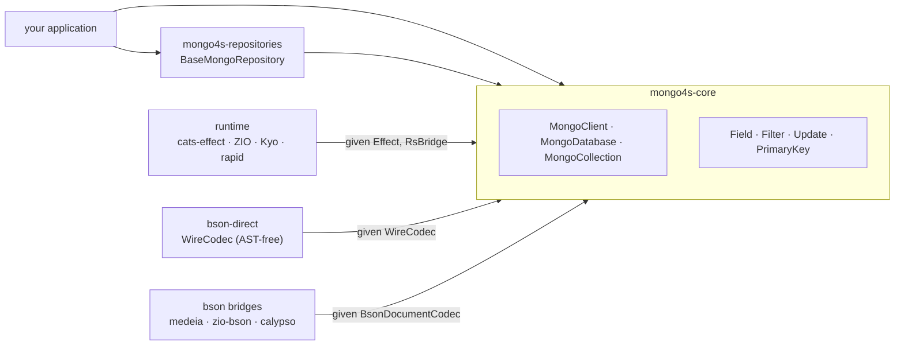

<p align="center">
  
</p>

# mongo4s

Effect-agnostic `MongoDB` client and repository layer for `Scala 3`. No hardcoded `cats-effect` or `fs2` — the runtime
(`cats-effect` / `ZIO` / `Kyo` / `rapid`) and the `BSON` codec (your own derivation, or `medeia` / `zio-bson` /
`calypso`) are
independent modules, each wired in through a `given` import. `core` depends on neither.

[](https://github.com/mongo4s/mongo4s/actions/workflows/ci.yml)
[](https://central.sonatype.com/search?q=mongo4s)
[](https://www.scala-lang.org/)
[](https://www.apache.org/licenses/LICENSE-2.0)

`mongo4s` wraps the official `mongodb-driver-reactivestreams` directly. A type-safe
`Field`/`Filter`/`Update` builder replaces string-keyed queries, `PrimaryKey` turns an entity into single- or
compound-key lookups, and `BaseMongoRepository` gives you CRUD/batch operations over a collection for free. Every
piece is interpretable against a real `MongoDB` **and** an in-memory `FakeMongoCollection`, so repositories are
unit-testable without a running database.



* [Quick start](#quick-start)
* [Core concepts](#core-concepts)
* [BSON codecs](#bson-codecs)
* [Repositories](#repositories)
* [Runtime backends](#runtime-backends)
* [Modules](#modules)
* [Benchmarks](#benchmarks)
* [Adopters](#adopters)
* [Design notes](#design-notes)
* [Changelog](CHANGELOG.md)
* [Roadmap](ROADMAP.md)
* [Contributing](#contributing)

## Quick start

Pick a runtime. The default codec (`bson-direct`) derives straight from your case class — AST-free, no
third-party codec library, no extra dependency beyond `mongo4s-core` itself:

```scala
libraryDependencies ++= Seq(
  "org.mongo4s" %% "mongo4s-cats"           % "3.0.0", // mongo4s-core + cats-effect integration
  "org.mongo4s" %% "mongo4s-bson-direct"    % "3.0.0", // ast-free bson codecs
  "org.mongo4s" %% "mongo4s-bson-cats-data" % "3.0.0", // if you need NonEmptyList etc. codec instances
  "org.mongo4s" %% "mongo4s-repositories"   % "3.0.0", // if you need auto-generated CRUD repository ops for your model
)
```

```scala
import cats.effect.{IO, IOApp}

import mongo4s.cats.{CatsStream, MongoClientResource}
import mongo4s.bson.direct.WireCodec
import mongo4s.{Field, PrimaryKey}
import mongo4s.repositories.BaseMongoRepository

import mongo4s.cats.CatsInstances.given

final case class User(id: String, name: String, age: Int) derives WireCodec

object User:
  given PrimaryKey[User, String] = PrimaryKey.single("id")(_.id)

object Main extends IOApp.Simple:
  def run: IO[Unit] =
    MongoClientResource.fromConnectionString[IO]("mongodb://localhost:27017").use { client =>
      for
        db <- client.getDatabase("myapp")
        collection <- db.getDirectCollection[User]("users")

        users = BaseMongoRepository(collection)

        _ <- users.insertOne(User("1", "Alice", 30))
        alice <- users.findOne("1")
        adults <- users.findByFilter(Field.of[User, Int](_.age).gte(18))
      yield ()
    }
```

Swap `mongo4s-cats` for `mongo4s-zio` / `mongo4s-kyo` / `mongo4s-rapid` and the matching `*Instances.given` import to
change runtime — the body of the `for` is identical. What does change is how you take the client, since each runtime
keeps its own resource idiom: cats gives you a `Resource` to `.use`, ZIO a scoped `ZIO` and kyo a `Scope` effect (both
bind inside the `for` and are discharged by `ZIO.scoped`/`Scope.run`), and rapid takes the body as a function —
`MongoClientResource.fromConnectionString(uri) { client => … }`. See
[examples/](examples/src/main/scala/mongo4s/examples) for one app per runtime.
`BsonEncoder`/`BsonDecoder` for built-in types (`String`,
`Int`, `Option`, `List`, `Vector`, `Set`, `Seq`, …) resolve with no import at all — no
`mongo4s.bson.BsonInstances.given` needed unless you're summoning one directly.

Already have a model on `medeia`, `zio-schema`, or `calypso`? Swap `derives WireCodec` + `getDirectCollection` for
`derives MedeiaDocumentCodec`/etc. + `getCollection` (and `BaseMongoRepository.create[F, S, User, String](db, "users")`
instead of constructing it from a collection directly — `E` and `K` come from the type arguments, not from the
arguments, so they have to be written out) — see [BSON codecs](#bson-codecs) below for all four backends.

Already have a `MongoClientSettings` built elsewhere (connection pool tuning, read/write concerns, TLS, credentials,
…)? Use `MongoClientResource.fromSettings` instead of `fromConnectionString`. `MongoClient.fromClient`/`fromSettings`/
`fromConnectionString` give you the same thing unwrapped, if you'd rather own `.close` yourself.

`MongoClientSettings` sets read/write concerns for the whole client. To narrow them, `MongoDatabase` and
`MongoCollection` both carry `withReadConcern`/`withWriteConcern`/`withReadPreference`, each returning a **new**
handle rather than mutating the one you have:

```scala
val durable = collection.withWriteConcern(WriteConcern.MAJORITY)
durable.insertOne(user)          // majority-acknowledged
collection.insertOne(other)      // still the client's default
```

Because the derived handle is an ordinary `MongoCollection`, per-operation control is just chaining:
`collection.withWriteConcern(w).insertOne(x)`. Concerns inherit database → collection, as they do in the driver, and
a collection derived this way keeps the codec it was opened with — including the `WireCodec` that
`getDirectCollection` registers.

A driver `CodecRegistry` is not how you plug a codec into `mongo4s`, though — see
[Codecs and the driver's registry](#codecs-and-the-drivers-registry).

For more examples see [examples/src/main/scala/mongo4s/examples](examples/src/main/scala/mongo4s/examples) — a
shared domain model (opaque types, enums, nested case classes) run through every runtime/codec combination
(`cats + medeia`, `ZIO + zio-bson`, `kyo + medeia`, `rapid + calypso`), a repository example covering all four
`BaseMongoRepository` construction styles against bson-direct, and a sessions/transactions + typed aggregation
pipeline example on `cats + medeia`. Most of what this README shows is compiled there too —
[`ReadmeSnippets.scala`](examples/src/main/scala/mongo4s/examples/ReadmeSnippets.scala) walks the same ground section by
section, so if the API moves and these docs don't, CI fails.

## Core concepts

`MongoClient[F, S]` → `MongoDatabase[F, S]` → `MongoCollection[F, S, A]` mirror the driver's own hierarchy, wrapped in
your effect `F[_]` and stream type `S[_]`:

```scala
trait MongoCollection[F[*], S[*], A]:
  def insertOne(document: A)(using session: Option[ClientSession] = None): F[InsertOneResult]

  def find(filter: Filter[A] = Filter.all)(using session: Option[ClientSession] = None): FindQuery[F, S, A]

  def updateOne(filter: Filter[A], update: Update[A], options: UpdateOptions = UpdateOptions.default)(using session: Option[ClientSession] = None): F[UpdateResult]

  def deleteOne(filter: Filter[A], options: DeleteOptions = DeleteOptions.default)(using session: Option[ClientSession] = None): F[DeleteResult]

  def findOneAndUpdate(filter: Filter[A], update: Update[A], options: FindOneAndUpdateOptions[A] = FindOneAndUpdateOptions.default[A])(using session: Option[ClientSession] = None): F[Option[A]]

  def aggregate[B](pipeline: Seq[Stage[A]])(using session: Option[ClientSession] = None)(using BsonDocumentDecoder[B]): AggregateQuery[F, S, B]

  def distinct[B](field: Field[A, B], filter: Filter[A] = Filter.all)(using session: Option[ClientSession] = None)(using BsonDecoder[B]): DistinctQuery[F, S, B]

  def createIndex(index: Index[A])(using session: Option[ClientSession] = None): F[String]

  def watch(options: WatchOptions[A] = WatchOptions.default[A])(using session: Option[ClientSession] = None)(using Streamable[S, ChangeEvent[A]]): S[ChangeEvent[A]]
// count, estimatedCount, insertMany, updateMany, deleteMany, bulkWrite, listIndexes, dropIndex, drop, ...
```

Every method that reaches the server takes an optional `ClientSession` and defaults to `None`, so none of that is
visible until you opt into [a transaction](#sessions--transactions).

### Field selectors

`Field.of[E, A](_.someField)` is a macro that reads a field selector at compile time — no strings, no reflection —
and gives you a typed path to build filters, updates, and sorts:

```scala
val adults = Field.of[User, Int](_.age).gte(18)
val named  = Field.of[User, String](_.name).equalTo("Jenna") && adults
val setAge = Field.of[User, Int](_.age).set(27)
val city   = Field.of[Order, String](_.address.city).equalTo("Barcelona") // dotted paths from nested selectors
```

Each segment is checked against the case class it is selected from, so `_.name.length` and `_.items.head.sku` are
compile errors rather than paths that render fine and match nothing.

Selector-derived names are spelled through the collection's `FieldNaming`. Names that are already what the document
stores — a map key, an array position, `_id`, a shape with no case class — go through `at`, `/` or `Field.stored`,
and are used verbatim:

```scala
val totals = Field.of[Order, Map[String, Int]](_.totals)
val eur    = totals.at("EUR")                         // "totals" is renamed, "EUR" is not
val first: Field[Order, Item] = itemsField / "0"      // any other stored segment
val id     = Field.stored[Order, ObjectId]("_id")
```

### Filters

```scala
ageField.gte(13) && ageField.lte(19)     // $and
ageField.notIn(List(40, 41, 42))         // $nin
tagsField.contains("urgent")             // array membership
tagsField.containsAll(List("a", "b"))    // $all
tagsField.hasSize(3)                     // $size
nameField.regex("^A")                    // $regex
scoreField.exists                        // $exists
scoreField.hasType(BsonTypeName.Int)     // $type
totalField.mod(4, 1)                     // $mod
Filter.text[User]("scala")               // $text
Filter.expr[User](someBsonDocument)      // $expr
locationField.near(berlin, maxDistance = Some(1500)) // $near — also $nearSphere
locationField.within(GeoShape.Within(area))          // $geoWithin
areaField.intersects(point)                          // $geoIntersects
```

The geospatial operators take GeoJSON `Geometry` values — `Point`, `LineString`, `Polygon` and the `Multi*` forms,
with longitude first as MongoDB expects. A polygon's rings have to close, so a ring that does not repeat its first
point is refused rather than sent for the server to reject. `$geoWithin` also takes the legacy `2d` shapes through
`GeoShape.Centre`, `CenterSphere` and `Box`.

`$near` sorts by distance and needs a geospatial index; distances are in metres for GeoJSON. The server refuses it
inside `$or` and inside an aggregation `$match` — `$geoNear` as a pipeline's first stage is the tool there, and it
goes through `Stage.raw` for now. `$geoWithin` needs neither an index nor a sort, so it is the cheaper choice when
you only want containment.

The comparisons have symbolic aliases where they read better — `===`, `=!=`, `>`, `>=`, `<`, `<=` — spelling the
same `Filter` as `equalTo`/`notEqualTo`/`gt`/`gte`/`lt`/`lte`.

`hasType` takes a `BsonTypeName`, not a string. The values are MongoDB's own `$type` aliases — `"object"` for a
document, `"binData"`, `"javascriptWithScope"` — which are easy to misspell into a filter that silently matches
nothing, so the enum spells them for you. `BsonTypeName.of(bsonValue)` names the type of a value you already have.

`itemsField.elemMatch(...)` is the one worth calling out: conditions combined on the array path alone can be
satisfied by *different* elements, and `$elemMatch` is how you require one element to satisfy all of them.

```scala
val bigOrder = itemsField.elemMatch(
  Field.of[Item, String](_.sku).equalTo("abc") && Field.of[Item, Int](_.quantity).gt(2)
)
```

`Filter.and`/`or` fold `Filter.all` and `Filter.none` away rather than emitting a one-element `$and`. That is what
makes an empty list safe: `field.in(Nil)` is `Filter.none`, not "match everything".

### Updates

```scala
ageField.set(31)                  // $set
ageField.inc(1)                   // $inc — also $mul, $min, $max
nameField.unset                   // $unset
tagsField.push("vip")             // $push — also $pull, $addToSet, and the $each variants
Update.setOnInsert(nameField, "") // $setOnInsert, for merge-style upserts
Update.rename(oldField, newField) // $rename — also currentDate, popFirst/popLast
```

Numeric operators only apply to numeric fields, so `Update.inc(nameField, 1)` does not compile. An `Option`-typed
field takes the unwrapped value — `scoreField.inc(5L)` on a `Field[User, Option[Long]]` — because `None` has no
numeric encoding, and the obvious stand-in, `$inc` by zero, is a write that quietly does nothing.

A numeric operator takes the field's own type, so on a `Field[User, Int]` only an `Int` compiles — `inc(1L)` and
`mul(1.5)` do not. That keeps *mongo4s* from being the one that changes the stored width. The **server** can still
change it: an `$inc` that overflows an `Int32` is stored as an `Int64`, silently, and a value that then no longer
fits the modelled `Int` is a decode error naming the value — `2147483711 is out of range for Int`. Model a counter
that can grow as `Long`, and read a field whose stored width you do not control as the widest type it can reach.

`$min` and `$max` take any type MongoDB orders — a date, a string, an `ObjectId` — not only a number, because that
is what the server compares. `$inc` and `$mul` stay numeric, since arithmetic is what they do.

`Update.combine`/`and` merge operators of the same name into one sub-document, so setting two fields produces one
`$set`. `Update.Raw` carries operators the `AST` does not model and merges the same way:

```scala
Update.set(nameField, "bob").and(Update.Raw[User](BsonDocument("$bit", BsonDocument("age",...)
) ) )
// {"$set": {"name": "bob"}, "$bit": {"age": ...}}
```

Rendering never mutates the document you handed to `Raw`, so the same value can be reused across updates and
rendered under more than one `FieldNaming`.

#### Pushing onto arrays

`pushAll` takes a `PushOptions[A]` carrying MongoDB's `$each` modifiers — `$slice`, `$sort` and `$position`. The
classic use is a capped, ordered log kept by the server:

```scala
tagsField.pushAll(List("vip"), PushOptions.default[String].sortedAscending.withSlice(10))
// {"$push": {"tags": {"$each": ["vip"], "$slice": 10, "$sort": 1}}}
```

`$sort` has two shapes and they are mutually exclusive, so setting one clears the other: `sortedAscending`/
`sortedDescending` for arrays of scalars, which the server sorts as bare values, and `sortedBy(Sort[A])` for arrays of
documents — `PushOptions.default[Note].sortedBy(Sort.desc(rankField))` renders `"$sort": {"rank": -1}`.

#### Updating array elements

The positional operators are path segments, so `/` builds them — `$[]` updates every element and needs nothing else:

```scala
val orderId: Field[Order, String]  = Field.of[Order, String](_.id)
val everyQty: Field[Order, Int]    = Field.of[Order, List[Item]](_.items) / "$[]" / "qty"

collection.updateOne(orderId.equalTo("1"), Update.set(everyQty, 0))
```

`$[identifier]` updates only the elements an *array filter* selects, and those go in `arrayFilters` on
`updateOne`/`updateMany`/`findOneAndUpdate`:

```scala
val lowQty: Field[Order, Int]    = Field.of[Order, List[Item]](_.items) / "$[low]" / "qty"
val elementQty: Field[Item, Int] = Field.stored("low.qty")

collection.updateOne(
  orderId.equalTo("1"),
  Update.set(lowQty, 100),
  UpdateOptions.default.withArrayFilters(Seq(elementQty.lt(3))),
)
```

Array-filter paths are written against the **stored** document — the identifier is not a field of your model, so
build them with `Field.stored` and spell the field names as they appear on the wire. Everything reached through `/`
is a stored segment too, so neither the identifier nor `$[]` is touched by the collection's `FieldNaming`.

#### Write options

`updateOne`/`updateMany` take an `UpdateOptions`, `replaceOne` a `ReplaceOptions`. Both are immutable, built by
chaining from `default`, and exist so that new options stay additive — a write method's signature never has to grow
another parameter again:

```scala
UpdateOptions.default                                     // nothing set
UpdateOptions.upsert                                      // shorthand for default.withUpsert
UpdateOptions.upsert.withArrayFilters(Seq(elementQty.lt(3)))
UpdateOptions.default.withCollation(caseInsensitive).withComment("nightly reconcile")
```

`deleteOne`/`deleteMany` take a `DeleteOptions` and `count` a `CountOptions`, on the same pattern:

```scala
collection.deleteMany(filter, DeleteOptions.default.withCollation(caseInsensitive))
collection.count(filter, CountOptions.default.withSkip(20).withLimit(10))
```

What each type carries today: `collation` and `hint` everywhere, `comment` on everything but `count`; `bypassDocumentValidation` on the two
that write whole documents (`UpdateOptions`, `ReplaceOptions`); `limit`, `skip` and `maxTime` on `CountOptions`.

Each operation family has its own options type on purpose rather than one shared bag: `upsert` means nothing on a
delete, and a type that offered it there would let you write down a request the server cannot answer.

The `findOneAnd*` trio works the same way, except its options carry the entity type because `sort` and `projection`
do — `FindOneAndUpdateOptions[A]`, `FindOneAndReplaceOptions[A]`, `FindOneAndDeleteOptions[A]`. `returnUpdated`
defaults to true, and `returningPrevious` is how you ask for the document as it was:

```scala
collection.findOneAndUpdate(filter, update)                                          // the updated document
collection.findOneAndUpdate(filter, update, FindOneAndUpdateOptions.default[User].returningPrevious)
collection.findOneAndUpdate(filter, update, FindOneAndUpdateOptions.upsert[User].withSort(Sort.asc(ageField)))
```

An update that would produce no operators throws instead of sending `{}` — MongoDB rejects it, and failing at the
call site beats a write that silently does nothing.

`bulkWrite` takes a `Seq[WriteCommand[E]]` — `InsertOne`/`ReplaceOne`/`UpdateOne`/`UpdateMany`/`DeleteOne`/`DeleteMany`,
carrying the same `Filter` and `Update` values the single-document calls take:

```scala
collection.bulkWrite(
  Seq(
    WriteCommand.InsertOne(User("2", "Bob", 41)),
    WriteCommand.updateOne(named, setAge), // lowercase helpers default upsert = false
    WriteCommand.DeleteMany(ageField.lt(0)),
  )
)
```

Commands run in the order given; `ordered = false` lets the server carry on past one that fails instead of stopping
there. `BulkWriteResult.upsertedIds` is keyed by each command's position in the sequence.

### Queries

`find` returns a builder; nothing is sent until `first`, `all`, `stream` or `attempting`:

```scala
collection
  .find(adults)
  .sort(Sort.asc(nameField))
  .projection(Projection.empty[User].include(ageField).withoutId)
  .skip(20)
  .limit(10)
  .hint(indexKeys)
  .collation(Collation.builder().locale("en").build())
  .maxTime(5.seconds)
  .batchSize(100)
  .comment("adults page 3")
  .all
```

`filter` narrows what is already there — it ands with the filter the query was built from — while `sort`,
`projection`, `skip` and `limit` replace. `first` reads one document rather than the query's `limit`. The same
`hint`/`collation`/`maxTime`/`batchSize`/`comment` options are on `aggregate`, which adds `allowDiskUse`, and
`collation`/`maxTime`/`batchSize` on `distinct`.

`Projection` keeps inclusion and exclusion apart, because MongoDB rejects a projection mixing them. They are separate
types — `Projection.empty` starts neutral and the first `include` or `exclude` commits it — so chaining `exclude` onto
an inclusion projection does not compile at all, rather than silently returning more fields than you asked for. `_id`
is the exception: `withoutId` drops it from an inclusion projection, giving `{"field": 1, "_id": 0}`.

`slice` cuts an array field down server-side, so a document with ten thousand comments does not travel to fetch the
last five. It is neither an inclusion nor an exclusion, so it chains onto any of the three without committing the
projection either way:

```scala
Projection.empty[Post].slice(commentsField, -5)                    // the last five
Projection.empty[Post].sliceFrom(commentsField, skip = 20, count = 10)
Projection.empty[Post].include(titleField).slice(commentsField, 5) // and still an inclusion
```

The field has to be an array — `slice` on a scalar does not compile. The document still decodes through the entity's
own codec, because the field is present and merely shorter.

Sorting by `$text` relevance is `Sort.byTextScore()`, which renders `{"score": {"$meta": "textScore"}}` and takes
the output field's name if you want a different one. It is what makes `Filter.text` useful — an unranked text search
returns matches in whatever order the server finds them:

```scala
collection.find(Filter.text("mongodb")).sort(Sort.byTextScore()).all
```

`explain` answers the question a typed filter otherwise leaves open — did it use an index?

```scala
val plan: IO[BsonDocument] = collection.find(adults).sort(Sort.asc(nameField)).explain()

val measured: IO[BsonDocument] =
  collection.find(adults).explain(ExplainVerbosity.EXECUTION_STATS)
```

It is on `find` and on `aggregate`, runs the query the builder had already produced — options, hint and collation
included — and returns the server's plan as a `BsonDocument`. `explain` on `aggregate` describes the whole pipeline,
not the `$limit`-ed form `first` sends.

The document stays a document because an explain result is not one shape. It is a union that depends on how the
server chose to optimise: the same `aggregate(...).explain()` call returns a top-level `queryPlanner` when MongoDB
collapses the pipeline into a plain query, and a top-level `stages` array when it does not. Inside, the plan is a
recursive tree over an open set of stage names, each carrying its own fields, with a layer per shard on a sharded
cluster — and the server stamps `explainVersion` on it precisely because it reserves the right to change.

`ExplainSummary` types the part that *is* stable — the questions you actually ask of a plan:

```scala
import mongo4s.results.ExplainSummary

val summary: IO[ExplainSummary] =
  collection.find(adults).explain(ExplainVerbosity.EXECUTION_STATS).map(ExplainSummary.of)

// summary.indexes            List("age_1")
// summary.usedIndex          true
// summary.scannedCollection  false
// summary.sortedInMemory     false — a SORT stage means the order was not index-provided
// summary.execution          Some(ExecutionSummary(returned, keysExamined, docsExamined, durationMillis))
```

It reads by walking for field names rather than by following a fixed path, so it answers the same way for a find, a
pipeline the server optimised into a find, and a pipeline it kept as stages. `execution` is present only when the
plan was actually run — `ExplainVerbosity.EXECUTION_STATS` or higher. It is a summary, not a model of the output:
when it cannot recognise something it says nothing rather than guessing, and the full document is still there.

### Partial reads

`find(...).all` decodes whole entities, which means every modelled field has to be there. When you want a few
fields rather than the document, `selectAs` names the shape you want and gives you exactly that:

```scala
val summaries = collection.find(adults).sort(Sort.asc(nameField)).selectAs[(name: String, age: Int)].all
// F[List[(name: String, age: Int)]]

summaries.map(_.map(_.name)) // fields are read by label, not by position
```

The named tuple is the whole specification. The projection sent to the server is built from its labels, and so is
the decoder, so the two cannot drift apart — there is no second place to keep in step, and no case class and codec
to declare for a shape you only wanted once. A label that is not a field of the entity, or a field asked for at the
wrong type, is a compile error naming it.

`selectAs` closes the chain: `filter`, `sort`, `skip` and `limit` are set before it, and `first`, `all`, `stream`
and `attempting` after it. It works the same on a `getDirectCollection`, which is where it matters most — the
entity's `WireCodec` demands every modelled field, so before this a partial read there was not possible at all.

Labels are *derived* names, spelled through the collection's `FieldNaming` exactly as `Field.of` is, so a
`(fullName: String)` on a `snakeCase` collection projects and reads `full_name`.

An `Option` label reads a field the document does not carry as `None`, which is the answer reading the whole entity
gives for the same document — a projected shape and a full read never disagree about the same absence. A field the
entity declares as required but the document is missing is still a decode error naming it, reported per document by
`attempting`.

One field per label: `selectAs[(city: String)]` cannot reach `address.city`, because a nested projection comes back
as a nested document that a flat result cannot represent. Project the outer field, or read the shape through
`getCollection` with a codec of your own.

### Results

Writes report what actually happened. `UpdateResult` carries `matchedCount`, `modifiedCount` and `upsertedId`, which
is the only way to tell "matched but unchanged" from "nothing matched", or to recover the id an upsert generated:

```scala
val result = collection.updateOne(filter, update, UpdateOptions.upsert)
result.map(r => if r.wasUpserted then r.upsertedId else None)
```

`DeleteResult` carries `deletedCount`; `BulkWriteResult` carries all four counts plus `upsertedIds`, keyed by the
position of the command that produced it. `InsertOneResult`/`InsertManyResult` carry the stored `_id`s.

**`upsertedId` is the document's `_id`, not your primary key**, and it is reported only when the upsert actually
inserted — an upsert that matched reports `matchedCount = 1` and `None`. Whether that `_id` is anything you
recognise depends on where your key lives:

| `PrimaryKey` | what ends up in `_id` | `upsertedId` | same as your `K`? |
| --- | --- | --- | --- |
| `single("id")(_.id)` — key on a plain field | generated by the server | `BsonObjectId` | **no** — different value *and* different type |
| `storedId(_._id)` — key **is** `_id` | your key | `BsonString("k1")` | yes |
| `WithId[ObjectId, E]` | the `ObjectId` you constructed it with | that same `ObjectId` | yes |

Read that table as three common arrangements, not as a rule — `_id` and `K` are independent. What lands in `_id`
is decided by the **entity's codec**; `PrimaryKey` only decides what the repository filters on. Let them disagree
and `upsertedId` is neither:

```scala
final case class Doc(_id: String, tenant: String, name: String) derives MedeiaDocumentCodec
object Doc:
  given PrimaryKey[Doc, String] = PrimaryKey.single("tenant")(_.tenant)

repo.upsert(Doc("d1", "tenant-A", "x"))  // K is "tenant-A"; upsertedId is BsonString("d1")
```

`_id` can also be an `Int`, or a whole subdocument, or pinned by the filter (`_id` equality in an upsert's filter
is copied into the document the server creates). That is why the type is `BsonValue` and not something narrower: at
the collection level there is no `K` to narrow it to, and at the repository level the key is not what the field
holds. `Repository.insertOne` returns `K` for exactly this reason — the key comes from the entity, which is right
in every arrangement above, whereas the id is only ever right about `_id`.

This all holds identically for `collection.replaceOne`/`updateOne` with `upsert` and for `Repository.upsert`/
`upsertMany` — the repository builds the same command.

Under an unacknowledged write concern (`w=0`) the server sends nothing back, so every one of these comes back empty —
zero counts, `None` for the ids. That is indistinguishable from a write that matched nothing, which is the trade
`w=0` makes: the driver has no answer to report. Nothing throws, so the write path stays usable; if you need to tell
the two apart, do not use `w=0`. `Repository.insertOne`/`insertMany` are the one exception: their key
comes from the entity you passed, never from the server, so they still return it under `w=0` — a write that failed
silently there returns a key just the same, exactly as `w=0` asks for.

### Reads that survive bad documents

`find(...).all` fails the whole query if any document does not decode. A collection is rarely written by one version
of one service, though, and when it isn't, a document that doesn't fit is a fact about the data rather than a reason
to lose the rest of the page. `attempting` reports each document separately:

```scala
val readable: IO[List[User]] =
  collection.find().attempting.all.map(_.collect { case Right(user) => user })

val everything: S[DecodeResult[User]] = collection.find().attempting.stream
```

`DecodeResult[A]` is `Either[BsonError, A]`. It's available on `find`, `aggregate` and `distinct`, and as
`watchAttempting` on a collection's `watch` — `watchAsAttempting` at the client and database level, where the
element type is named at the call site. Transport errors still fail the effect — only decoding is made per-document.

### Errors the server raises

A failed write does not arrive as a driver exception. `mongo4s` translates every failure the driver reports into
`MongoError`, so branching on one is a pattern match rather than a code comparison:

```scala
import mongo4s.MongoError

collection.insertOne(user).recoverWith {
  case MongoError.DuplicateKey(_)  => collection.replaceOne(byEmail, user).void
  case MongoError.WriteConflict(_) => retry
}
```

| Case | Raised for |
| --- | --- |
| `DuplicateKey` | a unique index violation |
| `WriteConflict` | two transactions touching the same document |
| `ExecutionTimeout` | `maxTime` expired, or the server's own limit |
| `Unauthorized` | the credentials do not allow the operation |
| `Unavailable` | the socket failed, or no server could be selected |
| `BulkWriteFailed` | one bulk command, several failures — `failures` keeps them all, `duplicateKeys` filters |
| `Failed` | anything else the server reported, with its `code` intact |

Every case carries `cause`, the driver's own exception, so nothing is lost — along with `code`, `labels` and
`hasLabel`, which is how `withTransaction` decides what to retry. Errors `mongo4s` raises itself are untouched:
`BsonError.DecodingFailure` for a document that does not fit, `RsBridgeError` for the stream bridge.

Translation happens on the `Publisher` before any runtime sees it, so `IO`, `Task`, `KIO`, `rapid.Task` and every
stream get the same type for the same failure. What `MongoError.DuplicateKey` deliberately does *not* carry is the
name of the index that was violated: the server sends it, but the driver's `WriteError.getDetails` comes back empty,
so the only remaining source is the human-readable message — and scraping that would be a guess that silently
changes with a server upgrade. Read `getMessage` when you need it.

### Primary keys

`PrimaryKey[E, K]` turns an entity into a key-based filter — a single field, a native `_id` (`ObjectId` or your own
encoder), or a compound key of any width:

```scala
given PrimaryKey[User, String]   = PrimaryKey.single("id")(_.id)
given PrimaryKey[Note, ObjectId] = PrimaryKey.storedId(_.id) // keys on "_id" — see WithId

given PrimaryKey[Order, (userId: String, seq: Int)] =
  PrimaryKey.compound(o => (userId = o.userId, seq = o.seq), FieldNaming.snakeCase)
```

`PrimaryKey.id(_.id)` is `single("id")` spelled short, for the common case.

A compound key is a **named tuple**, so its labels are the field names — there is no second list of strings to keep
in step with the extractors, and no arity ceiling. The labels are Scala identifiers; the optional `FieldNaming`
spells them the way the collection stores them, so `userId` above is written as `user_id` while the key still reads
as ordinary Scala at every call site:

```scala
users.findOne((userId = "u1", seq = 3))
```

The order of the labels is part of the key's type, so writing them in a different order at a call site is a compile
error rather than a key silently assembled wrong.

Field names are known without a key value — that is what lets
`repository.ensureKeyIndex` build the unique index that makes the key a key. Without one, two concurrent `upsert`s
on the same key can both miss and both insert.

`storedId` keys on `_id` whatever the key's type; the entity's codec has to actually write it there, so an entity
whose codec writes `id` will never match. Note that these are **stored** names, used verbatim: the collection's
`FieldNaming` is not applied to them, so under `snakeCase` write `"user_id"`, not `"userId"`.

For entities that don't carry their own id field, `WithId[ObjectId, E]` ships a ready-made `PrimaryKey` — no `given`
needed.

`inFilter` on a compound key produces an `$or` of `$and`s; on a single field it's a plain `$in` — and an empty key
list always produces `Filter.none`, so `findMany(Nil)`/`deleteMany(Nil)` are safe no-ops instead of matching every
document.

### Sessions & transactions

`client.withTransaction` opens a session, runs the body in a transaction on it, and closes it — on every path:

```scala
client.withTransaction {
  users.insertOne(User("2", "Bob", 41)) // Option[ClientSession] is already given here
}
```

The session is given implicitly to everything inside the body, so a collection or repository call joins the
transaction without being told to — no `(using Some(session))` at each call site.

**A helper defined elsewhere has to ask for it.** The session reaches calls that are written inside the body;
a method compiled somewhere else was compiled against the default — no session — and its writes commit on their own,
outside the transaction, which a rollback then does not undo. Give any helper the parameter and it joins:

```scala
def register(users: MongoCollection[F, S, User], user: User)(using Option[ClientSession]): F[Unit] =
  users.insertOne(user).void          // joins the caller's transaction

def register(users: MongoCollection[F, S, User], user: User): F[Unit] =
  users.insertOne(user).void          // commits outside it, silently
```

The two shapes differ by one `using` clause and by whether a rollback takes the write with it; there is no warning,
because a missing implicit is exactly what the default is there to supply. If you prefer passing a value, open the
session yourself with `client.startSession` and use `session.withTransaction`.

It commits on success and rolls back on failure **and on cancellation**: `Effect[F]` carries a `guaranteeCase` that
sees how the action ended, so an interrupted transaction does not linger on the server until it is reaped. A
rollback that itself fails is attached as a suppressed exception rather than replacing the error that caused it.

It also **retries**, the way the driver's own `withTransaction` does. A `TransientTransactionError` means nothing
was committed, so the whole transaction — body included — is started again; an `UnknownTransactionCommitResult`
means the commit may already have landed, so only the commit is asked again rather than the work being redone. Both
are bounded by one deadline taken before the first attempt, 120 seconds by default:

```scala
import mongo4s.operations.TransactionOptions

client.withTransaction(users.insertOne(User("2", "Bob", 41)), TransactionOptions.default.withRetryTimeout(10.seconds))

client.withTransaction(body, TransactionOptions.withoutRetries) // report the first failure, as 2.x did
```

`TransactionOptions` also carries the transaction's own `readConcern`, `writeConcern`, `readPreference` and
`maxCommitTime`. Errors the server did not label are never retried — a failure in your own code fails the
transaction immediately, exactly as before.

The deadline is measured with `Effect.monotonic`, which has a default implementation reading `System.nanoTime`; the
`cats` and `zio` backends override it with their runtime's own clock, so `TestControl`/`TestClock` can drive the
retry window in a test without waiting on a real one.

If you're reusing one already-open session across more than one transaction, the same behaviour applies to the session
itself — it commits and rolls back the same way, but leaves the session's own lifetime to you:

```scala
import mongo4s.withTransaction // the extension on ClientSession

for
  session <- client.startSession
  _       <- session.withTransaction(users.insertOne(User("2", "Bob", 41)))
  _       <- session.withTransaction(users.insertOne(User("3", "Carol", 29))) // same session, second transaction
  _       <- IO.delay(session.close())
yield ()
```

`MongoSession.startTransaction`/`commitTransaction`/`abortTransaction` are there for the fully manual path, where
you pass the session explicitly with `(using Some(session))` at each call site. Nothing is automatic on that path —
including the rollback.

Transactions need a replica set or sharded cluster.

### Aggregation pipelines

`aggregate` takes a `Seq[Stage[A]]` — a typed pipeline-stage AST, mirroring `Filter`/`Update`/`Sort`, instead of raw
`BsonDocument`s — built with the same `Field.of` selectors:

```scala
import mongo4s.operations.{Sort, Stage}

val pipeline = Seq(
  Stage.matching(Field.of[User, Int](_.age).gte(18)),
  Stage.sortBy(Sort.asc(Field.of[User, String](_.name))),
  Stage.limit(10),
)

// aggregate lives on the collection, and decodes into any type with a BsonDocumentCodec
val adults: IO[List[User]] = collection.aggregate[User](pipeline).all
```

Grouping uses typed accumulators:

```scala
import mongo4s.operations.Accumulator

val byAge = Seq(
  Stage.groupBy(Field.of[User, Int](_.age))(
    "count" -> Accumulator.count[User],
    "names" -> Accumulator.push(Field.of[User, String](_.name)),
  )
)
```

`Stage` covers `$match`/`$project`/`$sort`/`$limit`/`$skip`/`$count`/`$unwind`/`$lookup`/`$group`/`$addFields`/
`$replaceRoot`/`$facet`/`$sample`/`$unionWith`/`$bucket`/`$densify`/`$setWindowFields`/`$out`/`$merge`,
with `Stage.raw(document)` as the escape hatch for anything else.

`$lookup` has two forms. `Stage.lookup` is the equality join on `localField`/`foreignField`; `Stage.lookupWith` takes
a sub-pipeline that runs against the foreign collection, with `let` binding values from the outer document:

```scala
Stage.lookupWith[Order, User](
  from = "users",
  pipeline = List(Stage.matching(Field.of[User, Int](_.age).gte(18))),
  as = "adults",
  let = Some(BsonDocument("owner", BsonString("$user_id"))),
)

Stage.graphLookup[Order, User, String](
  from = "users",
  startWith = BsonString("$user_id"),
  connectFrom = Field.of[User, String](_.managerId),
  connectTo = Field.of[User, String](_.id),
  as = "chain",
  options = GraphLookupOptions.default[User].withMaxDepth(3).withDepthField("depth"),
)
```

Note the second type parameter: the sub-pipeline and the `connectFrom`/`connectTo` fields belong to the **foreign**
collection, so they are typed against it rather than against `A`. They are rendered with the outer collection's
`FieldNaming` — fine when a project uses one convention throughout, which is the usual case; if the two collections
disagree, spell the foreign names with `Field.stored`.

`$out` and `$merge` write the pipeline's result into a collection, and both take options that stay out of the way
until you need them — with none set they render as the bare collection name the server also accepts:

```scala
Stage.out[Order]("archive")                                        // {"$out": "archive"}
Stage.out[Order]("archive", OutOptions.default.inDatabase("cold")) // {"$out": {"db": "cold", "coll": "archive"}}

Stage.merge[Order](
  "archive",
  MergeOptions.default
    .onFields(List("user_id", "seq"))
    .whenMatched(MergeOptions.WhenMatched.KeepExisting)
    .whenNotMatched(MergeOptions.WhenNotMatched.Insert),
)
```

#### Bucketing, filling gaps and windows

`$bucket` takes its boundaries as values of the field being grouped, so they are typed rather than raw BSON, and
`default` names the bucket for everything outside them — without it the server rejects such a document:

```scala
Stage.bucketBy(ageField, Seq(0, 20, 40), default = Some(BsonString("other")))("count" -> Accumulator.count[Person])
```

`$densify` fills the gaps in a series, so every step is present whether or not a document was written for it —
useful before a window function that would otherwise skip the missing rows:

```scala
Stage.densify(ageField, DensifyRange.by(10).within(DensifyBounds.Between(BsonInt32(0), BsonInt32(40))))
Stage.densify(recordedAt, DensifyRange.every(1, DateUnit.Hour).within(DensifyBounds.Partition), Seq(sensorField.path))
```

`$setWindowFields` computes an accumulator over a span around each document rather than over the whole group. The
sort is what gives a window its direction, so it is required rather than optional; an output with no `window` covers
the whole partition:

```scala
Stage.setWindowFields(Sort.asc(ageField), partitionBy = Some(sensorField.path))(
  "runningTotal" -> WindowOutput(Accumulator.sum(ageField)).over(Window.documents(WindowBound.Unbounded, WindowBound.Current))
)
```

`Window.documents` counts in rows, `Window.range` in the sort field's own values — rows sharing a value fall in the
same window — and `Window.rangeOver` does the same for a date field measured in a `DateUnit`.

Both stages take their partition fields as `FieldPath` rather than `Field`, which is why the examples above write
`sensorField.path`: a partition is a list of fields of unrelated types, and `Field[E, ?]` loses the type the path
extension needs. Everything else about them is the usual typed selector.

`on` names fields of the **target** collection, so it is a list of stored names rather than `Field` values — the
target's shape is not `A`. A single field renders as a string and several as an array, which is what the server
expects. Note that `aggregate(...).first` does not append its usual `$limit` after a terminal stage, since the server
rejects anything following `$out`/`$merge`.

Two things about the typing. `A` is the pipeline's *starting* document type and never changes down the pipeline — a
`$group` or `$project` invents a new shape, but the stages after it are still typed against `A`, and the pipeline's
real output type is stated once, at `aggregate[B]`. And a field belonging to a stage's own output — `_id` after a
`$group`, a facet's counter — has no `Field[A, _]` to name it, so it goes through `Stage.raw`:

```scala
val buckets = Seq(
  Stage.groupBy(ageField)("count" -> Accumulator.count[User]),
  Stage.raw[User](BsonDocument("$sort", BsonDocument("_id", BsonInt32(1)))), // "_id" is the group's, not User's
)
```

`aggregate` asks for a `BsonDocumentDecoder[B]`, not a full codec: a pipeline's output is read and never written,
so a read model needs no encoder you would have to invent. A `BsonDocumentCodec` satisfies it, and
`aggregate[BsonDocument]` works out of the box — useful for `$facet` and ad-hoc `$project`s.

`aggregateDirect[B]` is the AST-free counterpart: it asks for a `WireCodec[B]` rather than a `BsonDocumentDecoder[B]`
and, on a collection opened with `getDirectCollection`, decodes the pipeline's output straight off the wire with no
`BsonDocument` in between — the same trip `find` already makes there.

```scala
final case class ByAge(_id: Int, total: Int) derives WireCodec

collection.aggregateDirect[ByAge](Seq(Stage.groupBy(ageField)("total" -> Accumulator.count[User]))).all
```

It carries the direct path's strictness with it — every field the output type declares has to be present, exactly
as for an entity read through `getDirectCollection`, so a model with a field the pipeline does not produce is a
decode error rather than a default. `attempting` reports it per document.

On a collection opened with `getCollection` the same call still works — the `WireCodec` is bridged to a document
codec — so the method is about the codec you have, not about which constructor you used.

It is worth reaching for when the pipeline returns *a lot*. Measured against a real MongoDB it is **1.6×** the
bridged path over ten thousand documents and indistinguishable from it over ten, where the round trip is all there is
— see [BENCHMARKS.md](BENCHMARKS.md#aggregation-through-a-cursor--real-mongodb).

### Indexes

`Index[E]` is built from the same field selectors, and carries the options MongoDB attaches to an index:

```scala
import mongo4s.operations.Index

collection.createIndex(Index.ascending(nameField).descending(ageField).named("name_age"))
collection.createIndex(Index.unique(idField))
collection.createIndex(Index.ascending(createdAtField).expiringAfter(30.days)) // TTL
collection.createIndex(Index.ascending(ageField).where(ageField.gte(18))) // partial
collection.createIndex(Index.text(bioField).withSparse)
collection.createIndex(Index.hashed(idField)) // sharding
collection.createIndex(Index.geo2DSphere(Field.stored[User, Any]("location"))) // also geo2D
collection.createIndex(Index.ascending(ageField).withHidden) // built, but ignored by the planner
collection.createIndex(Index.ascending(Field.stored[User, Any]("$**"))) // wildcard: just a stored path

collection.listIndexes // F[List[BsonDocument]], as the server reports them
collection.dropIndex("name_age")
```

Keys are ordered — a compound index is only usable by queries that respect that order. `createIndex` returns the
name the server gave it, and is idempotent, so it's safe on every start.

A wildcard index needs no API of its own: `$**` is an ordinary stored path, so `Field.stored` builds it and the
collection's `FieldNaming` leaves it alone. `withWildcardProjection` narrows which fields such an index covers, and
`withCollation` attaches one to any index.

`expireAfterSeconds` is a whole number on the server, so a sub-second `TTL` is rejected rather than silently truncated
to "expire immediately".

From a repository, `ensureKeyIndex` builds the unique index the `PrimaryKey` describes, without you restating its
fields.

### Creating a collection

MongoDB creates a collection on first write, so `createCollection` is for the cases where the shape has to be
declared up front — a capped log, a schema the server enforces, a time series, a clustered collection:

```scala
import mongo4s.operations.{ClusteredIndex, CreateCollectionOptions, TimeSeries}

database.createCollection("events", CreateCollectionOptions.capped(8 * 1024 * 1024).withMaxDocuments(10000))

database.createCollection(
  "readings",
  CreateCollectionOptions.default
    .withTimeSeries(TimeSeries.on("recordedAt").withMetaField("sensor").withGranularity(TimeSeriesGranularity.MINUTES))
    .expiringAfter(30.days),
)

database.createCollection("people", CreateCollectionOptions.default.withValidator(jsonSchema))
database.createCollection("orders", CreateCollectionOptions.default.withClusteredIndex(ClusteredIndex.onId))
```

`withCapped` takes the size because the server rejects a capped collection without one — there is no way to spell a
broken request here. Two combinations the server accepts and then quietly ignores are rejected instead: a
`maxDocuments` on a collection that is not capped, and a validation level or action with no validator to apply to.
Sub-second `expiringAfter` is refused for the same reason it is on an index — the server stores whole seconds, and
truncating to zero means "expire immediately".

`ClusteredIndex.onId` is the only clustered key offered because `_id` is the only one the server clusters on today.
Anything else this API does not model is still reachable through `database.runCommand`.

### Change streams

`watch` exists at all three levels, matching the driver's own scope hierarchy — `MongoClient.watch` (the whole
deployment), `MongoDatabase.watch` (one database), and `MongoCollection.watch` (one collection). All of them need a
replica set or sharded cluster:

```scala
val events: S[ChangeEvent[User]] = collection.watch()
```

Every event is a `ChangeEvent[A]`, not a bare `BsonDocument`:

```scala
final case class ChangeEvent[A](
  operationType: OperationType, // com.mongodb's own enum — INSERT/UPDATE/DELETE/...
  documentKey: Option[BsonDocument],
  fullDocument: Option[A],
  fullDocumentBeforeChange: Option[A],
  updateDescription: Option[UpdateDescription], // updated/removed field paths, for UPDATE events
  resumeToken: BsonDocument,
  clusterTime: Option[BsonTimestamp],
  wallTime: Option[BsonDateTime],  // when the change was applied, in server wall-clock time
  splitEvent: Option[SplitEvent],  // set only on a fragment of an event too large for one message
)
```

`MongoCollection.watch` decodes through the collection's own codec, so `fullDocument`/`fullDocumentBeforeChange`
come back as `Option[A]`. `MongoClient.watch`/`MongoDatabase.watch` span more than one document shape, so they
default to `ChangeEvent[BsonDocument]` — use `watchAs[A]` when you know the events all decode the same way.

Everything else is `WatchOptions[A]`:

```scala
import mongo4s.changestream.WatchOptions

collection.watch(
  WatchOptions
    .resumeAfter[User](token) // shorthand for default[User].resumingAfter(token)
    .withFullDocument(FullDocument.DEFAULT)
    .withMaxAwaitTime(2.seconds)
    .withBatchSize(64)
)

WatchOptions.default[User].startingAfter(token) // the other two starting points, same builder
WatchOptions.default[User].startingAt(timestamp)
```

`fullDocument` defaults to `UPDATE_LOOKUP`, not the server's own default — MongoDB fills the document in only for
inserts and replaces, which leaves the most common question ("what does this document look like now?") unanswered on
updates. It is always `None` for deletes; there is no document left to look up. `fullDocumentBeforeChange` needs
pre-images enabled on the collection.

`resumeToken` is on every event so a consumer that dies mid-stream can restart from just after the last event it
actually handled, rather than from now:

```scala
collection.watch().evalTap(handle).evalTap(e => saveToken(e.resumeToken))
// later, on restart:
collection.watch(WatchOptions.resumeAfter[User](savedToken))
```

`resumingAfter` and `startingAfter` are alternatives — each clears the other, since the server rejects a stream
carrying both `resumeAfter` and `startAfter`.

`withExpandedEvents` is the driver's `showExpandedEvents`: DDL events — `createIndexes`, `drop`, `rename` and the
rest — are reported alongside the document ones. It needs MongoDB 6.0, so the flag is sent only when you ask for it
rather than as a default an older server would reject.

`clusterTime` and `wallTime` answer different questions: the first is the logical timestamp the change is ordered
by, the second is the server's wall clock when it was applied — useful for lag, useless for ordering. `splitEvent`
is set only on the fragments of an event too large for one message, and says which fragment of how many; without
`$changeStreamSplitLargeEvent` in the pipeline you will never see it.

`WatchOptions.pipeline` filters the change stream itself, and matches against the **change event's own shape**
(`{operationType, fullDocument, ns, ...}`), not the collection's document shape. A `Field.of` path is therefore the
wrong tool: it would render `"age"` where the event needs `"fullDocument.age"`. Use `Stage.raw`, or `Field.stored`
for a path under `fullDocument`:

```scala
val insertsOnly = WatchOptions
  .default[User]
  .withPipeline(Seq(Stage.raw(BsonDocument("$match", BsonDocument("operationType", BsonString("insert"))))))

collection.watch(insertsOnly)
```

A change stream never completes on its own — take from it, or interrupt it. A document that does not decode ends it
with an error; `watchAttempting` — `watchAsAttempting` at the client and database level — reports the failure and
carries on instead, which is what you want for a long-lived subscription.

## BSON codecs

Every codec ultimately produces a `mongo4s.bson.BsonDocumentCodec[A]` (entity ⇄ `org.bson.BsonDocument`) or, for the
*AST-free* path below, a `WireCodec[A]`. Bring whichever backend fits — `mongo4s` never registers a global
`CodecProvider`, so backends never collide inside one process.

| Module | Backend                                                                        | Notes |
| --- |--------------------------------------------------------------------------------| --- |
| `mongo4s-bson-medeia` | [medeia](https://github.com/medeia/medeia)                                     | `derives BsonDocumentCodec` |
| `mongo4s-bson-zio` | [zio-bson](https://github.com/zio/zio-bson)                                    | `zio.bson.BsonCodec` (add `zio-schema-bson` yourself to derive one from a `Schema`) |
| `mongo4s-bson-calypso` | [calypso](https://github.com/m2-oss/calypso)                                   | hand-written `forProductN` codecs |
| `mongo4s-bson-direct` | [mongo4s itself](https://github.com/mongo4s/mongo4s/tree/main/bson/direct/src) | `WireCodec[A]`, AST-free — see below |
| `mongo4s-bson-cats-data` | [cats-core](https://typelevel.org/cats/) | `BsonEncoder`/`BsonDecoder`/`WireCodec` for `NonEmptyList`/`Chain`/`NonEmptyVector`/`NonEmptySet`/`NonEmptyMap`, `WireCodec` for `Ior` |

### `bson-direct` — AST-free `WireCodec`

`medeia`/`zio-bson`/`calypso` all build an intermediate `org.bson.BsonValue` tree before it ever reaches the driver.
`WireCodec[A]` skips that: it's derived via `Mirror` and writes straight to the driver's own streaming
`BsonWriter`/`BsonReader`, the same low-level SPI jsoniter-scala uses for JSON — no `BsonDocument` is ever built, on
either side. No third-party codec dependency needed; `bson-direct` is transitively pulled in by `mongo4s-core`.

```scala
import mongo4s.bson.direct.WireCodec

final case class Address(city: String, zip: String) derives WireCodec
final case class Person(id: String, name: String, tags: List[String], address: Address) derives WireCodec

sealed trait Shape derives WireCodec
object Shape:
  final case class Circle(radius: Double)                   extends Shape derives WireCodec
  final case class Rectangle(width: Double, height: Double) extends Shape derives WireCodec
```

Products, `Option`, `Either`, nested case classes, sealed traits/enums (via a `_type` discriminator field, written
first), and self-/mutually-recursive types all derive directly — recursive derivation is deferred behind a `lazy val`
internally so a type's own `given` never forces itself mid-construction.

**Nothing derives without being asked.** A type gets a `WireCodec` from `derives WireCodec`, from a `given` you
wrote, or from an existing `BsonEncoder`/`BsonDecoder` pair — never from merely being a case class. So a field whose
type you forgot to model is a compile error naming that type, not a codec invented for it, and an `opaque type` keeps
whatever representation you give it instead of borrowing the one underneath. The exception is the cases of an `enum`
or the leaves of a sealed trait: they cannot carry `derives` themselves, so the sum derives them — the same line
`circe` draws.

```scala
final case class Address(city: String) derives WireCodec
final case class Person(name: String, address: Address) derives WireCodec  // Address must have one

opaque type UserId = String
object UserId:
  given WireCodec[UserId] = ScalarWireCodec[String].imap(apply)(_.value)   // yours, not String's

enum Shape derives WireCodec:   // Circle and Square derive with it
  case Circle(radius: Double)
  case Square(side: Double)
```

`String`, `Int`, `Long`, `Double`, `Boolean`, `BigDecimal`, `Instant`, `UUID` and `ObjectId` are read and written
natively, in the same BSON representation the `BsonEncoder`/`BsonDecoder` path uses — `Decimal128` for `BigDecimal`,
`Date` for `Instant`, `ObjectId` for `ObjectId` — so the server indexes and range-compares them exactly as it would
on a collection opened with `getCollection`. Any *other* type with an existing `BsonEncoder`/`BsonDecoder` bridges
automatically, at the cost of one `BsonValue` per field instead of zero.

`List`/`Vector`/`Seq`/`Set`/`Array` write a real BSON array, and `Map[String, A]` a real `BSON` document keyed by its
own keys — `String` being the key type isn't a limitation of the general mechanism, it's just what BSON's own field
names are. Every *other* `Iterable` collection with a `scala.collection.Factory` (`Queue`, `ArraySeq`, `ListSet`,
`LazyList`, `SortedSet`/`TreeSet` given an `Ordering`, …) gets an array-shaped `WireCodec` too, generically — no
dedicated `given` needed per type.

`getDirectCollection` registers the derived codec with the driver via `CodecRegistries.fromCodecs(...)`, so
`insert/find/replace/update/delete/bulkWrite` decode straight to `A` — genuinely zero `BsonDocument` construction on the
hot path, not just a thinner bridge:

```scala
import mongo4s.bson.direct.WireCodec
import mongo4s.repositories.BaseMongoRepository

final case class Person(id: String, name: String, age: Int) derives WireCodec
object Person:
  given PrimaryKey[Person, String] = PrimaryKey.single("id")(_.id)

for
  db         <- client.getDatabase("myapp")
  collection <- db.getDirectCollection[Person]("people")
  repo        = BaseMongoRepository(collection)
  _          <- repo.insertOne(Person("1", "bob", 30))
yield ()
```

The trade for that speed is strictness: derivation requires every modelled field to be present, unless its decoder
supplies a default — which `Option` does. So a **projection that drops a field the entity declares cannot be read
back** through the entity's own codec. That is what `selectAs` is for — see [Partial reads](#partial-reads) — and
`getCollection` with a `BsonDocumentCodec` of your own remains the escape hatch below that.

Strictness stops at the field list, though — **not** at BSON numeric widths. A document that stores `42` as an
Int32 where the model says `Long` (written by `mongosh`, by a `$inc`, or by another service) reads the same through
`getDirectCollection` as through `getCollection`: any whole number in range is accepted, and one that cannot be a
whole number of that type — `7.5` into a `Long`, a value past `2^63` — is refused on both. A `Double` target is the
exception on both paths: every BSON number converts to one, so a very large `Int64` or a long `Decimal128` rounds
rather than being refused, exactly as `BsonDecoder[Double]` has always done. The rule is written once, in
`BsonDecoder`, and the wire codec defers to it, so the two cannot drift apart.

What that costs: a field stored in the width the model declares is read straight off the wire, allocating nothing;
a field stored in some other numeric width costs one `BsonValue` for the conversion. Matching data pays nothing for
the leniency.

`aggregate` decodes through `BsonDocumentCodec` because its output shape isn't `A`; `aggregateDirect` is the
AST-free counterpart for an output that has a `WireCodec`. `distinct` still goes through `BsonDecoder`, which reads
one `BsonValue` per result rather than a document, so there is no tree to skip. Everything else —
`Filter`/`Update`/`Field` construction — is identical regardless of which codec backs the collection.

#### Field naming

By default `derives WireCodec` writes field and discriminator names exactly as they appear in the Scala source. To
match an existing collection's naming convention (`snake_case`, say), bring a `WireCodecConfig` into scope before
deriving — it reuses the same `mongo4s.bson.FieldNaming` the query layer (`Filter`/`Update`/`Sort`) already uses,
rather than a second, independent naming mechanism:

```scala
import mongo4s.bson.direct.WireCodecConfig

given WireCodecConfig = WireCodecConfig.SnakeCase

final case class Person(firstName: String, lastName: String) derives WireCodec // writes "first_name"/"last_name"
```

Field naming and discriminator naming (the `_type` value for sealed traits/enums) are independently configurable.
`WireCodecConfig` is built by starting from `Default` (or `SnakeCase`) and chaining `withFieldNaming`,
`withDiscriminatorNaming`, `withEncodeEmptyCasesAsString`, `withOmitNoneFields` — the same shape `WatchOptions` uses,
and the reason new derivation options can be added in a minor release without breaking binary compatibility:

```scala
given WireCodecConfig = WireCodecConfig.SnakeCase.withDiscriminatorNaming(FieldNaming.snakeCase)
```

`getDirectCollection` takes no `naming` of its own: the codec is what writes the field names, so it is what decides
how a query spells them. A derived `WireCodec` reports the `WireCodecConfig` it was built with; a hand-written one
says so by overriding `fieldNaming`. `getCollection` still takes the parameter, because a `BsonDocumentCodec` from
`medeia`, `calypso` or `zio-bson` carries its own naming configuration that mongo4s cannot read; there the parameter
still has to match the codec.

`FieldNaming` applies per *derived* segment only. Stored names — `Field.stored`, a `PrimaryKey`'s field names, a
`$lookup`'s foreign field, map keys — are used verbatim. `FieldNaming.snakeCase` splits on every capital, so
`userID` becomes `user_i_d`; `FieldNaming.overrides(Map("userID" -> "userId"), fallback = snakeCase)` is the way out
of that.

`encodeEmptyCasesAsString = true` writes a parameterless case (`case object`/empty `case class`) as a bare BSON
string instead of a `{"_type": "..."}` document — only safe when that case is nested inside another document, not
when it's the root type of a collection (BSON's root value must always be a document).

#### Absent `Option` fields

A field holding `None` is **left out of the document entirely** rather than stored as an explicit `null` — the key
costs nothing on disk, and a collection of mostly-empty optional fields gets materially smaller. Reads are
unaffected either way: a missing field decodes to `None` through the same `defaultOnMissing` that has always
covered it, and a document already carrying an explicit `null` still decodes to `None`, so a collection written
before this keeps working unchanged.

```scala
final case class Contact(name: String, email: Option[String]) derives WireCodec

Contact("bob", None) // {"name": "bob"} — no "email" key at all
```

Two things do change with the field gone. `{field: null}` as a filter still matches, since MongoDB reads that
predicate as "null **or** missing", but `$exists: true` no longer matches a `None`, and a **sparse index** on that
field no longer includes those documents. Where either matters, `withOmitNoneFields(false)` restores the explicit
`null`:

```scala
given WireCodecConfig = WireCodecConfig.Default.withOmitNoneFields(false)
```

A nested `Option` does not survive a round-trip, with or without the flag: `Some(None)` is written as `null` and reads
back as `None`, because BSON has one null and both layers map onto it. This is true of the AST path
(`BsonEncoder`/`BsonDecoder`) as well. If you need to tell "absent" from "present but empty", model it as an `enum`
or a wrapper case class rather than `Option[Option[A]]`.

The flag governs *fields of a derived product* only. A `None` inside an array is still written as `null` regardless,
because dropping an element would shift every position after it. `Update.set(field, None)` also still writes `null` —
that is `BsonEncoder`, not `WireCodec`, and `$set: null` and `$unset` are different intents; use `field.unset` for
the latter. The AST bridges (`medeia`, `zio-bson`, `calypso`) follow their own library's rule here, not this flag.

#### Hand-writing a codec: `contramap`/`map`/`emap`/`imap`

A type that is not a case class, enum or sealed trait needs a codec written for it — `WireCodec[A]` is just
`WireEncoder[A] with WireDecoder[A]`, and both halves compose the same way `BsonEncoder`/`BsonDecoder` already do
elsewhere in mongo4s:

```scala
import mongo4s.bson.direct.WireCodec

enum Provider(val value: String):
  case Stripe extends Provider("stripe")
  case Adyen  extends Provider("adyen")

object Provider:
  def from(value: String): Option[Provider] = Provider.values.find(_.value == value)

  given WireCodec[Provider] =
    WireCodec[String].iemap(raw => from(raw).toRight(s"Unsupported provider: $raw"))(_.value)
```

`imap` (total in both directions) and `iemap` (decode can fail — reported as `BsonError.InvalidValue`) replace a
hand-rolled `WireCodec.instance(...)` for the common case of one type wrapping another: no `BsonWriter`/`BsonReader`
calls to write by hand, and the wrap/unwrap logic lives in exactly one place instead of being duplicated across the
encode and decode sides.

Resolution order matters when a type qualifies for more than one instance. An existing `BsonEncoder`/`BsonDecoder`
pair — hand-written, or coming from `mongo4s-bson-medeia`/`-zio`/`-calypso` — is bridged into a `WireCodec` and takes
precedence over automatic `Mirror` derivation, so a case class carrying those instances resolves without needing
`derives WireCodec`. Writing `derives WireCodec` on the type still wins over both: it puts a concrete instance in the
companion, which is more specific than either generic given.

#### `ScalarWireCodec` — reusing a `WireCodec` as a `BsonEncoder`

An opaque type over a primitive (`opaque type UserId = String`) typically needs a `WireCodec[UserId]` for
`getDirectCollection` *and* a `BsonEncoder[UserId]` for `Field.of[...].equalTo`/`PrimaryKey.single` — two
typeclasses, normally two independently hand-written codecs. `ScalarWireCodec[A]` — the type every primitive in
`WirePrimitiveInstances` actually has — closes that gap:

```scala
import mongo4s.bson.direct.ScalarWireCodec
import mongo4s.bson.BsonEncoder

opaque type UserId = String

object UserId:
  def apply(value: String): UserId = value
  extension (id: UserId) def value: String = id

  given ScalarWireCodec[UserId] = ScalarWireCodec[String].imap(UserId.apply)(_.value)
  given BsonEncoder[UserId]     = summon[ScalarWireCodec[UserId]].toBsonEncoder
```

`toBsonEncoder` builds one `BsonValue` per call — cheap on the query-construction path `BsonEncoder` actually runs
on, unlike materializing one for every field of every document, which is exactly what `WireCodec` exists to avoid
in the first place. `ScalarWireCodec` is deliberately narrower than `WireCodec`: a derived case class or sum type
(`derives WireCodec`) is genuinely document-shaped, so it's never typed as `ScalarWireCodec` — asking for one
(`ScalarWireCodec[SomeCaseClass]`) fails to compile instead of misbehaving at runtime.

#### `Either[A, B]`

`WireCodec[Either[A, B]]` derives given `WireCodec[A]` and `WireCodec[B]`, flat like a derived sealed trait
(`{"_type": "Circle", "radius": 2.0}`) rather than wrapped in a `Left`/`Right` envelope — the discriminator is each
branch's own runtime type name, and a document-shaped branch (a case class) has its fields inlined directly instead
of nested under a `"value"` key:

```scala
final case class ValidationError(message: String)
final case class Approved(reference: String)

// Right(Approved("abc")) -> {"_type": "Approved", "reference": "abc"}
// Left(ValidationError("bad input")) -> {"_type": "ValidationError", "message": "bad input"}
val result: Either[ValidationError, Approved] = ...
```

A scalar branch (no fields to inline, e.g. a bare `String`) keeps a `"value"` field, since a bare BSON scalar can't
also carry the discriminator in the same slot. The two branches must resolve to distinguishable type names —
`Either[Foo, Foo]`, or two differently-named types that happen to share a runtime class name once generics are
erased, throws when the codec is summoned rather than risking a silent wrong-branch decode later.

The discriminator is `ClassTag[A].runtimeClass.getSimpleName` — for `Int`/`Long`/`Double`/`Boolean`/etc, that's the *JVM
primitive's* name (`"int"`, not `"Integer"`), since `ClassTag[Int]`'s `runtimeClass` is the primitive class,
not the boxed one. Not a bug, just worth knowing if one branch is a bare numeric/boolean type.

### `bson-cats-data` — `cats.data` support

`NonEmptyList`/`Chain`/`NonEmptyVector`/`NonEmptySet`/`NonEmptyMap` get `BsonEncoder`/`BsonDecoder` and `WireCodec`
instances from `mongo4s-bson-cats-data`, delegating to the already-existing `List`/`Vector`/`Set`/`Map` instances
rather than reimplementing `BSON` encoding:

```scala
import mongo4s.bson.catsdata.CatsDataBsonInstances.given // or CatsDataWireInstances.given for bson-direct
import cats.data.NonEmptyList

final case class Team(members: NonEmptyList[String]) derives MedeiaDocumentCodec // or your codec backend's own derives
```

`NonEmptySet`/`NonEmptyMap` additionally need a `cats.Order` for their element/key type — the same `Order` you'd
already need to construct one of these types directly.

`Ior[A, B]` gets a `WireCodec` too, discriminated by each branch's own type name rather than
`"Left"`/`"Right"`/`"Both"`. Unlike `Either`, which inlines a case class branch's fields, `Ior`'s single-sided
branches always nest their payload under `"value"`. `Both` doesn't have a
single "own" type — it holds an `A` and a `B` at once — so its discriminator is the two names joined (`"String+Foo"`),
with each side nested under its own `"left"`/`"right"` key rather than inlined, to avoid a silent
field-name collision if `A` and `B` happen to share a field.

### Codecs and the driver's registry

The driver resolves codecs from a process- or client-wide `CodecRegistry`. `mongo4s` does not: a codec is resolved per
collection, from the `BsonDocumentCodec[A]` or `WireCodec[A]` in implicit scope at the `getCollection` /
`getDirectCollection` call. That is what lets medeia, zio-bson, calypso and `bson-direct` coexist in one process
without colliding.

So a `CodecRegistry` you set on `MongoClientSettings` is **not** where an entity codec belongs — mongo4s never asks it
for one, on either path:

* On the `getCollection` path, `mongo4s` asks the driver for `BsonDocument` and does its own encode/decode. So do
  `listIndexes`, `listCollections`, `runCommand`, `aggregate`, `distinct` and `watch` — all of them read
  `BsonDocument`/`BsonValue`. Your registry is never asked about `A`.
* On the `getDirectCollection` path, `mongo4s` registers the derived `WireCodec[A]` **ahead of** the client's registry,
  so a `Codec[A]` registered there does not silently shadow the codec the collection was opened with.

That does not make it inert, though. It is still load-bearing in two ways:

* **It has to keep providing the driver's own `BsonDocument` codec.** Since `mongo4s` reads and writes `BsonDocument`
  everywhere, a registry that *replaces* the defaults instead of extending them fails every single operation with
  `CodecConfigurationException: Can't find a codec for … BsonDocument`. Always build yours as
  `CodecRegistries.fromRegistries(yours, MongoClientSettings.getDefaultCodecRegistry)`.
* **It governs everything past `underlying`.** `MongoClient`/`MongoDatabase`/`MongoCollection` each expose the driver
  object they wrap, and there the driver's rules apply in full — `collection.underlying.withDocumentClass(classOf[Foo])`
  resolves `Foo` from your registry, `mongo4s` not involved.

So: set a registry for driver-level defaults, or for a type you handle through the escape hatch — not to route the
entities `mongo4s` already has codecs for.

## Repositories

`BaseMongoRepository[F, S, E, K]` implements `Repository` — `count/find/insert/upsert/update/delete/bulkWrite`, batched
by `batchSize` (default 500) — over any `MongoCollection[F, S, E]`, from either codec path.

Reads and writes that take a *condition* rather than a key come in two spellings, and the name says which: `…ByField`
takes a field and a value, `…ByFilter` takes a whole `Filter`. `findByField`/`findByFilter` return a `List`,
`getByField`/`getByFilter` the same rows as a stream, and `updateByField`/`updateByFilter` and
`deleteByField`/`deleteByFilter` write to every row that matches:

```scala
users.findByField(nameField, "alice")             // List[User]
users.getByField(nameField, "alice")              // the same, as a stream
users.updateByField(ageField, 30, birthday)       // every 30-year-old
users.deleteByField(ageField, 30)                 // likewise
```

A `…ByField` call is exactly its `…ByFilter` counterpart over `field.equalTo(value)` — there for the common case
that would otherwise spell out a one-field filter.

`bulkWrite` takes the same `ordered` flag the collection does. An ordered bulk is sent in batches, which keeps its
meaning — it stops at the first failure and what came before it stays applied. An **unordered** bulk is sent as one
command, because the point of `ordered = false` is that the server applies everything it can, and batching would
stop at the first batch that failed instead.

```scala
BaseMongoRepository(collection)                              // over a collection you already have
BaseMongoRepository.create[F, S, E, K](db, "collection")     // reads return the document as stored, _id included
BaseMongoRepository.withoutId[F, S, E, K](db, "collection")  // strips _id from reads — for entities that do not model it
BaseMongoRepository.objectId[F, S, E](db, "collection")      // WithId[ObjectId, E], auto _id round-trip
```

`create` is the default, and it is the right one far more often than it looks: none of the four codec backends
rejects a document carrying an `_id` the entity does not model — `medeia`, `zio-bson`, `calypso` and a bridged
`WireCodec` all decode it and ignore the field. So `withoutId` is not needed to make such an entity readable.

Reach for it when a codec **you** wrote is strict about unknown fields, or when you would rather not carry `_id`
over the wire at all. Never reach for it for an entity keyed on `_id`: the projection strips the key, and it comes
back missing.

`insertOne` returns the entity's `K`, and `insertMany` the `K` of every entity, in insertion order and across
batches. A repository carries a `PrimaryKey[E, K]`, so it can name what it just inserted rather than hand back a
raw `BsonValue` for you to decode. `MongoCollection` has no key type and keeps returning the driver's
`InsertOneResult`/`InsertManyResult` — that is where the server's own `_id` still lives.

Paging goes through `Page`:

```scala
import mongo4s.repositories.Page

users.findByFilter(adults, Page.sortedBy(Sort.asc(nameField)).skipping(20).taking(10))
users.getByFilter(adults, Page.first(100)) // same, as a stream
```

Skip-based paging re-scans what it skips, so it degrades on deep pages — and a row deleted earlier in the
collection shifts everything after it, so a walk can miss rows it never saw. `findPage` avoids both by asking for
what comes *after* a key rather than for an offset:

```scala
val firstPage = users.findPage(100)
val nextPage  = users.findPage(100, after = Some(pk.key(firstPage.last)))

users.findPage(100, after = Some(lastKey), filter = adults) // narrowed, still paged by key
```

The repository already knows the key's fields, so it builds both halves itself: the sort that gives the page an
order, and the comparison that steps past the cursor. For a compound key that comparison is lexicographic — an
`$or` over "first field greater, or first equal and second greater, or …" — which is the part that is easy to get
subtly wrong by hand. `ensureKeyIndex` builds the index that makes the whole walk a range scan.

The cursor is the key of the last row you handled, so a crash resumes from there rather than from an offset that no
longer means the same thing.

`ensureKeyIndex` builds the unique index the `PrimaryKey` describes. `WithId[Id, E]` wraps an entity with a
separately-typed id (`type Oid[E] = WithId[ObjectId, E]`) and ships its own `PrimaryKey`/`BsonDocumentCodec`
instances, for entities that don't carry their own id field — it lives in `mongo4s-core`, so it's available whether
or not you use the repository layer.

Like `MongoCollection`, every `Repository` method takes `(using session: Option[ClientSession] = None)` — a
repository call can join a [transaction](#sessions--transactions) the same way a raw `collection` call can.

`BaseMongoRepository` is `open`: adding a domain query means declaring it against `collection`/`Filter`/`Field`
directly, not reimplementing what's already there.

For unit tests, `FakeMongoCollection` (in `mongo4s-testkit`, a published module — add it as
`"org.mongo4s" %% "mongo4s-testkit" % "3.0.0" % Test`) implements `MongoCollection` in memory. The exact same
`Filter`/`Update`/`Field` AST the real driver interprets is interpreted against an in-memory buffer instead, so
repository logic is testable without a running MongoDB.

Filters, updates, sorting, paging and projections are simulated, and so is a subset of `aggregate`:
`$match`, `$sort`, `$skip`, `$limit`, `$project`, `$count` and `$group` with `$sum`, `$avg`, `$min`, `$max`,
`$first`, `$last` and `$push`. That covers the pipelines most service code writes, so aggregating no longer forces a
test to reach for Docker.

`distinct` is simulated too, array fields flattened into their elements the way the server does, and so is `$slice`
in a projection. Filters follow the server's array semantics — a filter on an array field matches its elements, and a
dotted path descends through an array of documents — `$regex` searches rather than anchors and honours its options,
`$eq null` matches a missing field, `$inc` keeps the width the server keeps, and an insert stamps an `_id` and
refuses a duplicate one — through `insertOne`, `insertMany`, a `bulkWrite` insert, and an upsert that inserts, so
`wasUpserted` and `upsertedIds` say what the server would say.

Every update operator is simulated — `$set`, `$unset`, `$inc`, `$mul`, `$min`, `$max`, `$rename`, `$currentDate`,
`$push` with its `$each`/`$position`/`$slice`/`$sort` modifiers, `$pull`, `$pullAll`, `$pop` and `$addToSet` — and
`$setOnInsert` correctly does nothing on an update that matches.

Everything else throws `UnsupportedOperationException` naming what was asked for, rather than quietly answering
wrong — a fake that lies is worse than no fake. That includes `watch`, `explain`, `$text` and ranking by
`$meta textScore`, `$expr`, the geospatial operators, `Filter.Raw`, `Stage.Raw`, `Update.Raw`, an update carrying
`arrayFilters`, every aggregation stage outside the list above, and the `$addToSet` *accumulator*, which is refused
on purpose: MongoDB leaves the order of its result undefined, so no fake can be faithful to it. Replace-based upserts — what `upsert`/`upsertMany` go through — insert on a miss the way the
server does; an `update`-based `UpdateOptions.upsert` that matches nothing throws instead of guessing what the
operators would have built.

One caveat carries over from `find`: where MongoDB does not define an order, neither does the fake, and the two need
not agree. `$group` emits its buckets in the order their keys were first seen, and `distinct` the order it first met
each value. End the pipeline with `$sort`, or sort the values yourself, if the order matters — as you would have to
against a real server anyway.

`FakeRepository` is the same idea one layer up: a real `BaseMongoRepository` over a `FakeMongoCollection`, so the
repository logic under test is the one that ships. `repository.fake` reaches the collection underneath, for seeding
and for `snapshot`.

## Runtime backends

Each runtime module provides `given Effect[F]` (sequencing, failure, and a finalizer that sees how the action ended)
and `given RsBridge[F, S]` (Reactive-Streams `Publisher` → `F`/`S`):

| Module | Effect | Stream | Notes |
| --- | --- | --- | --- |
| `mongo4s-cats` | any `F` with `cats.effect.kernel.Async` | `fs2.Stream` | via `fs2.interop.reactivestreams` |
| `mongo4s-zio` | `zio.Task` | `zio.stream.ZStream` | via `zio-interop-reactivestreams` |
| `mongo4s-kyo` | `A < (Async & Abort[Throwable])` | `kyo.Stream` | via `kyo-reactive-streams` |
| `mongo4s-rapid` | `rapid.Task` | `rapid.Stream` | |

`MongoClient.fromClient`/`fromSettings`/`fromConnectionString` return a bare `F[MongoClient[F, S]]` — you own calling
`.close`. Every runtime module also ships `MongoClientResource` with the same three constructor names, wrapped in
that runtime's own resource-safety idiom rather than one type copy-pasted across all four:

```scala
// cats — cats.effect.Resource
import mongo4s.cats.MongoClientResource

MongoClientResource.fromConnectionString[IO]("mongodb://localhost:27017").use { client =>
  // logic
}
```

```scala
// zio — ZIO.acquireRelease, released when the enclosing ZIO.scoped block exits
import mongo4s.zio.MongoClientResource

ZIO.scoped:
  for
    client <- MongoClientResource.fromConnectionString("mongodb://localhost:27017")
    ...
  yield ()
```

```scala
// kyo — Scope.acquireRelease, released by Scope.run
import mongo4s.kyo.MongoClientResource

Scope.run:
  for
    client <- MongoClientResource.fromConnectionString("mongodb://localhost:27017")
    ...
  yield ()
```

```scala
// rapid has no Resource/Scope type — Task.guarantee is its only finalizer primitive, attached to an
// already-known computation — so this is bracket-shaped (a `use` callback) instead of a composable value
import mongo4s.rapid.MongoClientResource

MongoClientResource.fromConnectionString("mongodb://localhost:27017") { client =>
  // logic
}
```

### Bridge configuration

`RsBridgeConfig` controls how a driver `Publisher` becomes your `F` and `S`. A `given` of your own overrides the
default wherever an `RsBridge` is summoned:

```scala
import mongo4s.RsBridgeConfig

given RsBridgeConfig = RsBridgeConfig.default
  .withBufferSize(512)        // outstanding demand for streaming reads
  .withTimeout(5.seconds)     // per non-streaming operation; unset by default
  .withStrictSingleResult     // fail on a second result instead of taking the first
```

`bufferSize` bounds memory against a fast cursor. On `cats` and `kyo` it does not apply to `all`, which asks for
everything by definition; `zio` and `rapid` read `all` through the same buffered source as a stream, so it applies
there. `timeout` is a backstop for a cursor that stops signalling entirely — the driver has its own timeouts,
and streams are deliberately excluded, since a change stream sitting idle is working rather than stuck.
`strictSingleResult` is off by default, matching the driver.

Operations that expect at most one document read two, not the whole cursor — enough to notice a second result under
`strictSingleResult`, and no more. `find(...).first` and `AggregateQuery.first` also push a `limit`/`$limit` to the
server, so on those the server sends one document and `strictSingleResult` has nothing to catch; it is `distinct` and
the other single-result publishers that it guards.

## Modules

Published for `Scala 3.9 LTS` under `org.mongo4s`:

```scala
"org.mongo4s" %% "mongo4s-<module>" % "3.0.0"
```

| | Module | Notes |
| --- | --- | --- |
| core | `mongo4s-core` | `MongoClient`/`MongoDatabase`/`MongoCollection`, `Field`/`Filter`/`Update`, `PrimaryKey`, `WithId`; depends on `bson-core` + `bson-direct` only |
| bson | `mongo4s-bson-core` | `BsonEncoder`/`BsonDecoder`/`BsonDocumentCodec` — the scalar + document codec seam |
| | `mongo4s-bson-direct` | `WireCodec[A]` — AST-free product/sum derivation, no third-party dependency |
| | `mongo4s-bson-cats-data` | `cats.data` (`NonEmptyList`/`Chain`/`NonEmptyVector`/`NonEmptySet`/`NonEmptyMap`/`Ior`) instances |
| | `mongo4s-bson-medeia` | bridges `medeia`'s `derives BsonDocumentCodec` |
| | `mongo4s-bson-zio` | bridges `zio-bson` (add `zio-schema-bson` yourself for the `Schema`-derived route) |
| | `mongo4s-bson-calypso` | bridges `calypso`'s `forProductN` |
| runtime | `mongo4s-cats` | `cats-effect 3` + `fs2` |
| | `mongo4s-zio` | ZIO 2 + `zio-streams` |
| | `mongo4s-kyo` | kyo 1.0.0-RC6 |
| | `mongo4s-rapid` | rapid |
| repositories | `mongo4s-repositories` | `BaseMongoRepository`, `Repository`, `Page` |
| testkit | `mongo4s-testkit` | `FakeMongoCollection`, `FakeRepository` — in-memory doubles for unit tests |

Every module is built with the same Scala version, so there is no longer a subset that a project on an older
compiler has to do without.

### Compatibility

Binary compatibility within a major version is checked by [MiMa](https://github.com/lightbend/mima) on every build,
new `Effect`/`RsBridge` methods carry default implementations, and deprecations get at least one minor release before
removal. `mongo4s-kyo` sits outside the promise while kyo is on a release candidate.

`3.0.0` moves the whole build onto `Scala 3.9 LTS` and drops `3.3 LTS`. `TASTy` is not forward compatible, and that
is a break MiMa cannot see, which is why it takes a major release rather than a minor. What it buys is one Scala
version across every module: the three that used to be pinned to a fast-release `3.8` are on the LTS line with the
rest. It carries API changes of its own — compound `PrimaryKey`s became named tuples, `WireCodec` no longer
derives itself unasked, and driver exceptions arrive as `MongoError` — each with a migration note in
[COMPATIBILITY.md](COMPATIBILITY.md).

Full policy, the migration guides and the Scala-version rules: **[COMPATIBILITY.md](COMPATIBILITY.md)**.
What changed in each release: **[CHANGELOG.md](CHANGELOG.md)**. What is not covered yet and how it will land:
**[ROADMAP.md](ROADMAP.md)**.

## Benchmarks

Six JMH harnesses in [`benchmarks/`](benchmarks), against `mongo4cats` as a reference point. The short version:
`bson-direct`'s `WireCodec` writes and reads real BSON bytes **2.7–3.2×** faster than either `mongo4cats` codec and
allocates up to **6.9×** less; against a real `MongoDB` every single-document operation lands inside run-to-run
error for all six stacks, while bulk reads pull ahead — `mongo4cats` allocates **2.0–13×** more on
`findAll`/`findStream`, and its `find(...).stream` runs at **10 ops/s** against `mongo4s`'s **232**.

Those server-backed rates are latency-bound on the machine they were measured on — `MongoDB` in Docker on macOS,
where a bare `ping` inside the container already costs over 2 ms. They compare stacks honestly; read them as ratios
rather than as throughput a server can deliver.

Every table, the methodology and the commands to reproduce them: **[BENCHMARKS.md](BENCHMARKS.md)**.

## Adopters

<a href="https://betby.com">
  <picture>
    <source media="(prefers-color-scheme: dark)" srcset="logos/betby.svg"/>
    
  </picture>
</a>

Using mongo4s? Open a PR to add your logo.

## Design notes

Four decisions the rest of the library follows from: **Scala 3 only**, so field selectors can be macros and codecs
can be `derives`; **no global state**, so codecs are per-collection and four backends coexist in one process;
**`Effect[F]`'s `guaranteeCase` sees cancellation**, so an interrupted transaction rolls back instead of lingering;
and **`Filter`/`Update` are a real AST**, not the driver's opaque builders, so the same query runs against MongoDB
or against an in-memory buffer.

Each of those, the failure that motivated it, the sharp edges accepted along the way, and what was rejected:
**[DESIGN.md](DESIGN.md)**.

## Contributing

Bug reports and PRs are welcome. See [CONTRIBUTING.md](CONTRIBUTING.md) for how to build the project,
run its tests, and where to make changes for common kinds of contributions. This project follows the
[Contributor Covenant](CODE_OF_CONDUCT.md); please report security issues per [SECURITY.md](SECURITY.md)
rather than in a public issue.

## License

Apache 2.0 — see [LICENSE](LICENSE).
